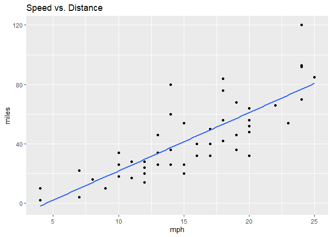
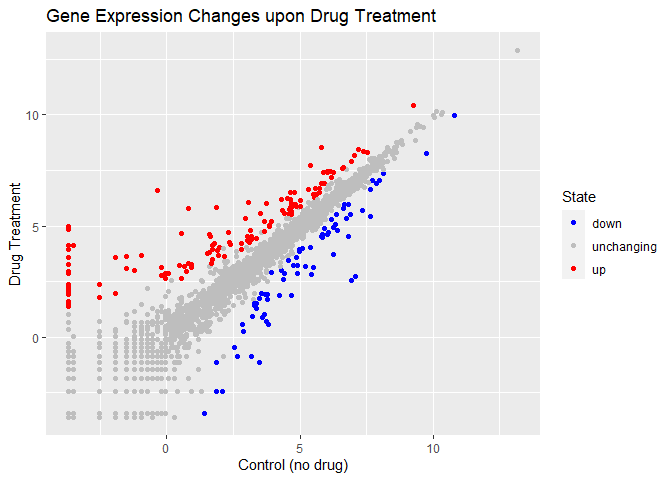
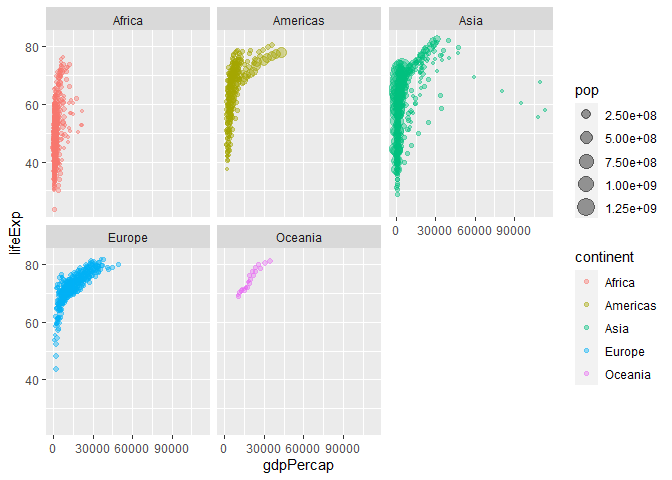

class05
================
Nate Tran

\#install.packages(“ggplot2”) \#install.packages(“gapminder”)

``` r
head(cars, 10)
```

       speed dist
    1      4    2
    2      4   10
    3      7    4
    4      7   22
    5      8   16
    6      9   10
    7     10   18
    8     10   26
    9     10   34
    10    11   17

``` r
plot(cars)
```


ggplot requires 3 components:

**1. Data** (in the form of a data.frame)  
**2. Aesthetics** (aes() for short)  
**3. Geometries** (e.g. geom_point() or geom_line())

``` r
library(ggplot2)
ggplot(cars) + 
  aes(x=speed, y=dist) + 
  geom_point() + 
  geom_smooth(method = "lm", se = F) +
  labs(title = "Speed vs. Distance") +
  xlab("mph") +
  ylab("miles")
```

    `geom_smooth()` using formula = 'y ~ x'



## Gene Expression

``` r
genes <- read.delim("https://bioboot.github.io/bimm143_S20/class-material/up_down_expression.txt")
head(genes)
```

            Gene Condition1 Condition2      State
    1      A4GNT -3.6808610 -3.4401355 unchanging
    2       AAAS  4.5479580  4.3864126 unchanging
    3      AASDH  3.7190695  3.4787276 unchanging
    4       AATF  5.0784720  5.0151916 unchanging
    5       AATK  0.4711421  0.5598642 unchanging
    6 AB015752.4 -3.6808610 -3.5921390 unchanging

``` r
nrow(genes)
```

    [1] 5196

``` r
colnames(genes)
```

    [1] "Gene"       "Condition1" "Condition2" "State"     

``` r
ncol(genes)
```

    [1] 4

``` r
table(genes$State)
```


          down unchanging         up 
            72       4997        127 

``` r
round((table(genes$State)/nrow(genes))*100, 2)
```


          down unchanging         up 
          1.39      96.17       2.44 

There are 5196 genes in this dataset.

``` r
ggplot(genes) +
  aes(x=Condition1, y=Condition2, color = State) +
  geom_point() + 
  scale_color_manual(values = c("blue", "gray", "red")) +
  labs(title = "Gene Expression Changes upon Drug Treatment") +
  xlab("Control (no drug)") +
  ylab("Drug Treatment")
```



## Gapminder

``` r
library(gapminder)
length(unique(gapminder$country))
```

    [1] 142

``` r
gapminder[which.min(gapminder$pop), "country"]
```

    # A tibble: 1 × 1
      country              
      <fct>                
    1 Sao Tome and Principe

``` r
gapminder[which.min(gapminder$pop),]
```

    # A tibble: 1 × 6
      country               continent  year lifeExp   pop gdpPercap
      <fct>                 <fct>     <int>   <dbl> <int>     <dbl>
    1 Sao Tome and Principe Africa     1952    46.5 60011      880.

``` r
ggplot(gapminder) +
  aes(x=gdpPercap, y=lifeExp, color=continent, size=pop) +
  geom_point(alpha=0.4) +
  facet_wrap("continent")
```


