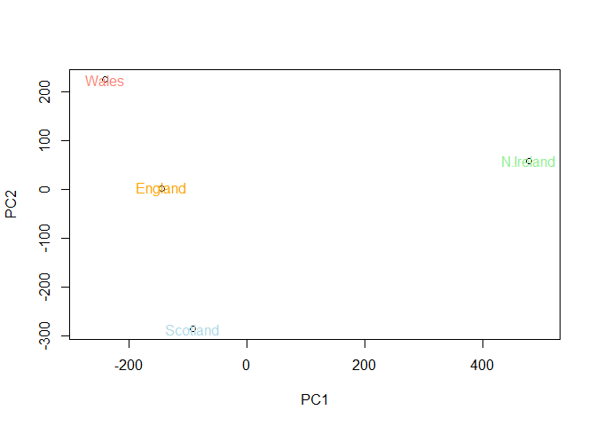
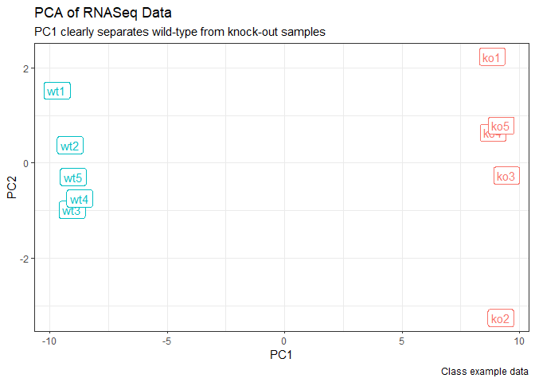

lab07
================
Nate Tran

# PCA of UK Food Data

## Data Import and QC

``` r
data <- read.csv("https://tinyurl.com/UK-foods")
```

## Q1

There are 17 rows and 5 columns in the dataset.

``` r
dim(data)
```

    [1] 17  5

``` r
rownames(data) <- data[,1]
data <- data[,-1]
```

## Q2

I prefer to read and load the data in first, then manually check it so I
can make any necessary adjustments based on what I observe from the
structure of the data. I believe this approach is more robust because we
cannot assume that the first column will always contain the desired row
names.

## Q3

Omitting or setting the “beside” argument to false in barplot() function
results in the following plot.

``` r
barplot(as.matrix(data), col=rainbow(nrow(data)))
```


## Q4 Missing(?)

## Q5

The following code plots the pairwise correlations for all 17 food
categories between two countries (each plot is at the intersection of
two country names; these are the two countries being compared in each
plot). If a given point lies on the diagonal in a certain plot, that
food category has a similar consumption rate in the two countries being
compared in the plot.

``` r
pairs(data, col=rainbow(10), pch=16)
```


## Q6

Northern Ireland has much lower consumption of fresh fruits, cheese,
fish, and alcoholic drinks than other countries in this dataset. N.
Ireland also consumes more fresh potatoes than the other countries.

## PCA Time

``` r
pca <- prcomp(t(data))
summary(pca)
```

    Importance of components:
                                PC1      PC2      PC3       PC4
    Standard deviation     324.1502 212.7478 73.87622 4.189e-14
    Proportion of Variance   0.6744   0.2905  0.03503 0.000e+00
    Cumulative Proportion    0.6744   0.9650  1.00000 1.000e+00

``` r
pca$x
```

                     PC1         PC2         PC3           PC4
    England   -144.99315    2.532999 -105.768945  2.842865e-14
    Wales     -240.52915  224.646925   56.475555  7.804382e-13
    Scotland   -91.86934 -286.081786   44.415495 -9.614462e-13
    N.Ireland  477.39164   58.901862    4.877895  1.448078e-13

## Q7

``` r
plot(pca$x[,1], pca$x[,2], xlab="PC1", ylab="PC2", xlim=c(-270,500))
text(pca$x[,1], pca$x[,2], colnames(data))
```


## Q8

``` r
plot(pca$x[,1], pca$x[,2], xlab="PC1", ylab="PC2", xlim=c(-270,500))
text(pca$x[,1], pca$x[,2], colnames(data), col=c("orange", "salmon", "lightblue", "lightgreen"))
```



## Q9

Fresh potatoes and soft drinks are the dominant features in the PC2
loadings plot. PC2 mainly differentiates the contributions of fresh
potatoes vs. soft drinks to the difference between Wales and Scotland,
which differ the most with respect to PC2.

``` r
par(mar=c(10, 3, 0.35, 0))
barplot(pca$rotation[,2], las=2)
```


# PCA of RNA-seq Data

## Data Import and Preparation

``` r
rna_data <- read.csv("https://tinyurl.com/expression-CSV", row.names=1)
```

## Q10

There are 100 genes and 10 samples.

``` r
dim(rna_data)
```

    [1] 100  10

Checking if data needs to be scaled.

``` r
round(colMeans(rna_data), 2)
```

       wt1    wt2    wt3    wt4    wt5    ko1    ko2    ko3    ko4    ko5 
    480.13 481.13 481.77 478.68 479.22 522.22 525.76 525.43 524.37 523.51 

``` r
round(apply(rna_data, 2, sd), 2)
```

       wt1    wt2    wt3    wt4    wt5    ko1    ko2    ko3    ko4    ko5 
    293.44 289.35 294.86 291.31 292.57 275.66 279.82 280.00 276.55 281.89 

rna_data contains data with same units of gene expression throughout and
does not necessarily need rescaling.

## PCA Time

``` r
#performing PCA with scaling as shown in lab example
pca <- prcomp(t(rna_data), scale=T)
```

``` r
#Plotting PC1 v PC2 using ggplot for practice
library(ggplot2)

#making 'wt' and 'ko' condition columns in new data.frame
df <- as.data.frame(pca$x)
df$samples <- colnames(rna_data)
df$condition <- substr(colnames(rna_data), 1, 2)

PC_plot <- ggplot(df) +
  aes(PC1, PC2, label=samples, col=condition) +
  geom_label(show.legend=F)
```

``` r
PC_plot + labs(title="PCA of RNASeq Data",
       subtitle = "PC1 clearly separates wild-type from knock-out samples",
       caption="Class example data") +
     theme_bw()
```


