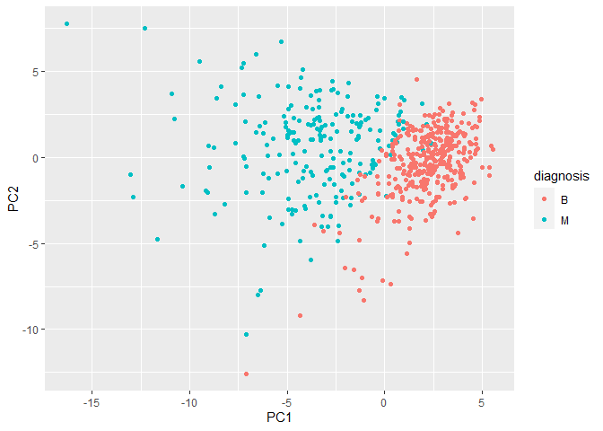

class08
================
Nate Tran

# Data Preparation

``` r
wisc.df <- read.csv("WisconsinCancer.csv", row.names=1)
wisc.data <- wisc.df[,-1]
diagnosis <- as.factor(wisc.df$diagnosis)
```

## Q1

There are 569 observations in the dataset.

``` r
nrow(wisc.df)
```

    [1] 569

## Q2

There are 212 observations with malignant diagnoses.

``` r
table(diagnosis)
```

    diagnosis
      B   M 
    357 212 

## Q3

There are 10 features in the data suffixed with “\_mean”.

``` r
length(grep("_mean",colnames(wisc.df)))
```

    [1] 10

``` r
#checking if wisc.data needs to be scaled
round(colMeans(wisc.data), 2)
```

                radius_mean            texture_mean          perimeter_mean 
                      14.13                   19.29                   91.97 
                  area_mean         smoothness_mean        compactness_mean 
                     654.89                    0.10                    0.10 
             concavity_mean     concave.points_mean           symmetry_mean 
                       0.09                    0.05                    0.18 
     fractal_dimension_mean               radius_se              texture_se 
                       0.06                    0.41                    1.22 
               perimeter_se                 area_se           smoothness_se 
                       2.87                   40.34                    0.01 
             compactness_se            concavity_se       concave.points_se 
                       0.03                    0.03                    0.01 
                symmetry_se    fractal_dimension_se            radius_worst 
                       0.02                    0.00                   16.27 
              texture_worst         perimeter_worst              area_worst 
                      25.68                  107.26                  880.58 
           smoothness_worst       compactness_worst         concavity_worst 
                       0.13                    0.25                    0.27 
       concave.points_worst          symmetry_worst fractal_dimension_worst 
                       0.11                    0.29                    0.08 

``` r
round(apply(wisc.data, 2, sd), 2)
```

                radius_mean            texture_mean          perimeter_mean 
                       3.52                    4.30                   24.30 
                  area_mean         smoothness_mean        compactness_mean 
                     351.91                    0.01                    0.05 
             concavity_mean     concave.points_mean           symmetry_mean 
                       0.08                    0.04                    0.03 
     fractal_dimension_mean               radius_se              texture_se 
                       0.01                    0.28                    0.55 
               perimeter_se                 area_se           smoothness_se 
                       2.02                   45.49                    0.00 
             compactness_se            concavity_se       concave.points_se 
                       0.02                    0.03                    0.01 
                symmetry_se    fractal_dimension_se            radius_worst 
                       0.01                    0.00                    4.83 
              texture_worst         perimeter_worst              area_worst 
                       6.15                   33.60                  569.36 
           smoothness_worst       compactness_worst         concavity_worst 
                       0.02                    0.16                    0.21 
       concave.points_worst          symmetry_worst fractal_dimension_worst 
                       0.07                    0.06                    0.02 

The data needs to be scaled, since the mean and SD values are so
variant.

\#PCA Time

``` r
wisc.pr <- prcomp(wisc.data, scale=T)
summary(wisc.pr)
```

    Importance of components:
                              PC1    PC2     PC3     PC4     PC5     PC6     PC7
    Standard deviation     3.6444 2.3857 1.67867 1.40735 1.28403 1.09880 0.82172
    Proportion of Variance 0.4427 0.1897 0.09393 0.06602 0.05496 0.04025 0.02251
    Cumulative Proportion  0.4427 0.6324 0.72636 0.79239 0.84734 0.88759 0.91010
                               PC8    PC9    PC10   PC11    PC12    PC13    PC14
    Standard deviation     0.69037 0.6457 0.59219 0.5421 0.51104 0.49128 0.39624
    Proportion of Variance 0.01589 0.0139 0.01169 0.0098 0.00871 0.00805 0.00523
    Cumulative Proportion  0.92598 0.9399 0.95157 0.9614 0.97007 0.97812 0.98335
                              PC15    PC16    PC17    PC18    PC19    PC20   PC21
    Standard deviation     0.30681 0.28260 0.24372 0.22939 0.22244 0.17652 0.1731
    Proportion of Variance 0.00314 0.00266 0.00198 0.00175 0.00165 0.00104 0.0010
    Cumulative Proportion  0.98649 0.98915 0.99113 0.99288 0.99453 0.99557 0.9966
                              PC22    PC23   PC24    PC25    PC26    PC27    PC28
    Standard deviation     0.16565 0.15602 0.1344 0.12442 0.09043 0.08307 0.03987
    Proportion of Variance 0.00091 0.00081 0.0006 0.00052 0.00027 0.00023 0.00005
    Cumulative Proportion  0.99749 0.99830 0.9989 0.99942 0.99969 0.99992 0.99997
                              PC29    PC30
    Standard deviation     0.02736 0.01153
    Proportion of Variance 0.00002 0.00000
    Cumulative Proportion  1.00000 1.00000

## Q4

44.27% of the original variance is captured by PC1.

## Q5

3 PCs are required to describe at least 70% of the original variance.

## Q6

7 PCs are required to describe at least 90% of the original variance.

# Interpreting PCA

Making scree plot is good way to find “intrinsic dimensionality” of the
dataset

``` r
attributes(wisc.pr)
```

    $names
    [1] "sdev"     "rotation" "center"   "scale"    "x"       

    $class
    [1] "prcomp"

``` r
#calculate variance by squaring SD
var <- wisc.pr$sdev^2

#calculate proportion of variance due to each PC
pve <- var/sum(var)

plot(pve, xlab = "Principal Component", 
     ylab = "Proportion of Variance Explained", 
     ylim = c(0, 1), type = "o")
```


``` r
biplot(wisc.pr)
```


## Q7

Nothing stands out about this plot aside from its excessive messiness
and extreme difficulty in interpreting. This is primarily due to the
large amount of observations and variables we are trying to observe
here.

## Q8

These plots have less and less clear separation between malignant and
benign samples when using less important PCs.

``` r
plot(wisc.pr$x[,c(1,3)], col = diagnosis, 
     xlab = "PC1", ylab = "PC3")
```


Plotting PC plot with ggplot!

``` r
library(ggplot2)

pc <- as.data.frame(wisc.pr$x)

ggplot(pc) +
  aes(PC1, PC2, col=diagnosis) +
  geom_point()
```



## Q9

The feature concave.points_mean contributes -0.261 to the first PC.

``` r
wisc.pr$rotation[,1]
```

                radius_mean            texture_mean          perimeter_mean 
                -0.21890244             -0.10372458             -0.22753729 
                  area_mean         smoothness_mean        compactness_mean 
                -0.22099499             -0.14258969             -0.23928535 
             concavity_mean     concave.points_mean           symmetry_mean 
                -0.25840048             -0.26085376             -0.13816696 
     fractal_dimension_mean               radius_se              texture_se 
                -0.06436335             -0.20597878             -0.01742803 
               perimeter_se                 area_se           smoothness_se 
                -0.21132592             -0.20286964             -0.01453145 
             compactness_se            concavity_se       concave.points_se 
                -0.17039345             -0.15358979             -0.18341740 
                symmetry_se    fractal_dimension_se            radius_worst 
                -0.04249842             -0.10256832             -0.22799663 
              texture_worst         perimeter_worst              area_worst 
                -0.10446933             -0.23663968             -0.22487053 
           smoothness_worst       compactness_worst         concavity_worst 
                -0.12795256             -0.21009588             -0.22876753 
       concave.points_worst          symmetry_worst fractal_dimension_worst 
                -0.25088597             -0.12290456             -0.13178394 

# Hierarchical clustering

## Preparing Data

``` r
data_scaled <- scale(wisc.data)
data_dist <- dist(data_scaled)
wisc.hclust <- hclust(data_dist, method="complete")
```

## Q10

With a height of 19, the model using a complete clustering method has 4
clusters.

``` r
plot(wisc.hclust)
abline(h=19, col="red", lty=2)
```


Cutting tree into 4 clusters and assigning membership

``` r
wisc.clusters <- cutree(wisc.hclust, k=4)
table(wisc.clusters, diagnosis)
```

                 diagnosis
    wisc.clusters   B   M
                1  12 165
                2   2   5
                3 343  40
                4   0   2

## Q12

The ward.D2 method gives the best looking results with two more distinct
groupings based on the dendrogram, likely correlating with malignant and
benign diagnoses.

# Combining Methods: PCA and hclust

We can cluster in PC-space using as many or few PCs as we want!

``` r
#clustering on 3 PC-space
wisc.pr.hclust <- hclust(dist(wisc.pr$x[,1:3]), method="ward.D2")

plot(wisc.pr.hclust)
```


Finding out whether these two main clusters correlate with malignant and
benign

``` r
groups <- cutree(wisc.pr.hclust, k=2)
table(groups, diagnosis)
```

          diagnosis
    groups   B   M
         1  24 179
         2 333  33

Calculating accuracy of our clustering method with verified diagnoses

``` r
(179+333)/nrow(wisc.data)
```

    [1] 0.8998243

## Q13

The newly created model separates out the two different diagnoses very
well with an accuracy of about 90%.

## Q14

The other hierarchical clustering models created in previous sections
perform similarly to the combined PCA/clustering approach

``` r
table(wisc.clusters, diagnosis)
```

                 diagnosis
    wisc.clusters   B   M
                1  12 165
                2   2   5
                3 343  40
                4   0   2

``` r
(165+343)/nrow(wisc.data)
```

    [1] 0.8927944

\#Prediction!

``` r
new_data <- read.csv("https://tinyurl.com/new-samples-CSV")
new_predict <- predict(wisc.pr, newdata=new_data)
new_predict
```

               PC1       PC2        PC3        PC4       PC5        PC6        PC7
    [1,]  2.576616 -3.135913  1.3990492 -0.7631950  2.781648 -0.8150185 -0.3959098
    [2,] -4.754928 -3.009033 -0.1660946 -0.6052952 -1.140698 -1.2189945  0.8193031
                PC8       PC9       PC10      PC11      PC12      PC13     PC14
    [1,] -0.2307350 0.1029569 -0.9272861 0.3411457  0.375921 0.1610764 1.187882
    [2,] -0.3307423 0.5281896 -0.4855301 0.7173233 -1.185917 0.5893856 0.303029
              PC15       PC16        PC17        PC18        PC19       PC20
    [1,] 0.3216974 -0.1743616 -0.07875393 -0.11207028 -0.08802955 -0.2495216
    [2,] 0.1299153  0.1448061 -0.40509706  0.06565549  0.25591230 -0.4289500
               PC21       PC22       PC23       PC24        PC25         PC26
    [1,]  0.1228233 0.09358453 0.08347651  0.1223396  0.02124121  0.078884581
    [2,] -0.1224776 0.01732146 0.06316631 -0.2338618 -0.20755948 -0.009833238
                 PC27        PC28         PC29         PC30
    [1,]  0.220199544 -0.02946023 -0.015620933  0.005269029
    [2,] -0.001134152  0.09638361  0.002795349 -0.019015820

Plotting new_data predictions against the wisc.pr PC plot

``` r
plot(wisc.pr$x[,1:2], col= diagnosis)
points(new_predict[,1], new_predict[,2], col="blue", pch=16, cex=3)
text(new_predict[,1], new_predict[,2], c(1,2), col="white")
```


## Q16

We should prioritize patient \#2 for followup based on the prediction
results since patient \#2 clusters with other patients with malignant
diagnoses.
