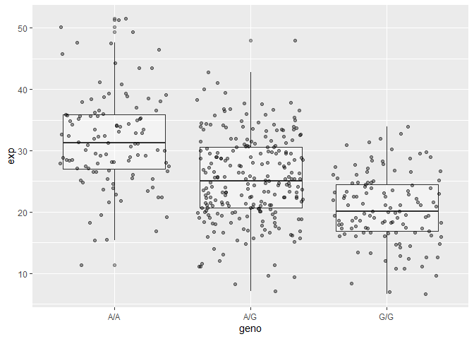

Lab11 Part 2
================
Nate Tran

# Section 4: Population Scale Analysis

Reading file into environment and preliminarily exploring data.

``` r
data <- read.table("pop_rs8067378.txt")
summary(data)
```

        sample              geno                exp        
     Length:462         Length:462         Min.   : 6.675  
     Class :character   Class :character   1st Qu.:20.004  
     Mode  :character   Mode  :character   Median :25.116  
                                           Mean   :25.640  
                                           3rd Qu.:30.779  
                                           Max.   :51.518  

``` r
unique(data$geno)
```

    [1] "A/G" "A/A" "G/G"

## Q13

There are: 108 samples with genotype A/A, with a median expression value
of 31.25. 233 samples with genotype A/G, with a median expression value
of 25.06. 121 samples with genotype G/G, with a median expression value
of 20.07.

``` r
#extracting indices for each genotype sample group
idx_AA <- grep("A/A", data$geno)
idx_AG <- grep("A/G", data$geno)
idx_GG <- grep("G/G", data$geno)

#determining sample size for each genotype
length(idx_AA)
```

    [1] 108

``` r
length(idx_AG)
```

    [1] 233

``` r
length(idx_GG)
```

    [1] 121

``` r
#calculating median expression levels for each genotype
median(data$exp[idx_AA])
```

    [1] 31.24847

``` r
median(data$exp[idx_AG])
```

    [1] 25.06486

``` r
median(data$exp[idx_GG])
```

    [1] 20.07363

## Q14

Based on the below boxplot, we can infer that each G substitution at the
SNP position progressively decreases the expression of ORMDL3. The SNP
and its different allele states definitely affects ORMDL3 expression.

``` r
library(ggplot2)

ggplot(data) +
  aes(geno, exp) +
  geom_boxplot(alpha=0.4) +
  geom_jitter(alpha=0.4)
```


