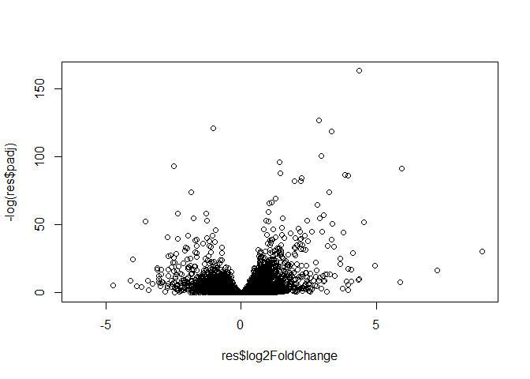

lab12
================
Nate Tran

# DESeq2 Required Inputs

``` r
counts <- read.csv("airway_scaledcounts.csv", row.names=1)
metadata <-  read.csv("airway_metadata.csv")
```

Exploring data

``` r
head(counts)
```

                    SRR1039508 SRR1039509 SRR1039512 SRR1039513 SRR1039516
    ENSG00000000003        723        486        904        445       1170
    ENSG00000000005          0          0          0          0          0
    ENSG00000000419        467        523        616        371        582
    ENSG00000000457        347        258        364        237        318
    ENSG00000000460         96         81         73         66        118
    ENSG00000000938          0          0          1          0          2
                    SRR1039517 SRR1039520 SRR1039521
    ENSG00000000003       1097        806        604
    ENSG00000000005          0          0          0
    ENSG00000000419        781        417        509
    ENSG00000000457        447        330        324
    ENSG00000000460         94        102         74
    ENSG00000000938          0          0          0

``` r
metadata
```

              id     dex celltype     geo_id
    1 SRR1039508 control   N61311 GSM1275862
    2 SRR1039509 treated   N61311 GSM1275863
    3 SRR1039512 control  N052611 GSM1275866
    4 SRR1039513 treated  N052611 GSM1275867
    5 SRR1039516 control  N080611 GSM1275870
    6 SRR1039517 treated  N080611 GSM1275871
    7 SRR1039520 control  N061011 GSM1275874
    8 SRR1039521 treated  N061011 GSM1275875

``` r
metadata$id == colnames(counts)
```

    [1] TRUE TRUE TRUE TRUE TRUE TRUE TRUE TRUE

``` r
all.equal(metadata$id, colnames(counts))
```

    [1] TRUE

## Q1

There are 38694 genes in the dataset.

## Q2

There are 4 control cell lines

# Initial Analysis

Grouping controls and calculating mean for control sample gene
expression.

## Q3

Below code is more robust.

``` r
control_idx <- metadata[metadata$dex == "control",]$id
control_counts <- counts[,control_idx]
control_means <- rowMeans(control_counts)
```

Grouping treated conditions and calculating mean for treated sample gene
expression.

## Q4

Followed same procedure below for treated samples.

``` r
treated_idx <- metadata[metadata$dex == "treated",]$id
treated_counts <- counts[,treated_idx]
treated_means <- rowMeans((treated_counts))
```

Combining these two dataframes of mean expression for brevity.

``` r
mean_counts <- cbind.data.frame(control_means, treated_means)
```

## Q5a

``` r
plot(mean_counts)
```


## Q5b

I would use geom_point in ggplot2.

Plotting with ggplot2

``` r
library(ggplot2)

ggplot(mean_counts) +
  aes(control_means, treated_means) +
  geom_point()
```


Building logarithmic plot to view more points.

``` r
plot(mean_counts, log="xy")
```

    Warning in xy.coords(x, y, xlabel, ylabel, log): 15032 x values <= 0 omitted
    from logarithmic plot

    Warning in xy.coords(x, y, xlabel, ylabel, log): 15281 y values <= 0 omitted
    from logarithmic plot


Adding log2FC to mean_counts

``` r
mean_counts$log2fc <- log2(mean_counts$treated_means/mean_counts$control_means)
```

## Q7

The purpose of the arr.ind argument returns both the row and column
indices. We need to use the unique() function so we can find rows where
one or two 0 values are located.

Cleaning results of NaN and -Inf from weird math.

``` r
my_counts <- mean_counts[(rowSums(mean_counts[,1:2] == 0) == 0),]
```

Counting how many genes are up or downregulated

``` r
up_idx <- my_counts$log2fc > 2
down_idx <- my_counts$log2fc < -2

sum(up_idx)
```

    [1] 250

``` r
sum(down_idx)
```

    [1] 367

## Q8

There are 250 upregulated genes

## Q9

There are 367 downregulated genes

## Q10

We do not trust all these results because we have not taken into account
statistical significance.

# DESeq2 Analysis

``` r
#/ message: false
library(DESeq2)
```

    Loading required package: S4Vectors

    Loading required package: stats4

    Loading required package: BiocGenerics


    Attaching package: 'BiocGenerics'

    The following objects are masked from 'package:stats':

        IQR, mad, sd, var, xtabs

    The following objects are masked from 'package:base':

        anyDuplicated, aperm, append, as.data.frame, basename, cbind,
        colnames, dirname, do.call, duplicated, eval, evalq, Filter, Find,
        get, grep, grepl, intersect, is.unsorted, lapply, Map, mapply,
        match, mget, order, paste, pmax, pmax.int, pmin, pmin.int,
        Position, rank, rbind, Reduce, rownames, sapply, setdiff, sort,
        table, tapply, union, unique, unsplit, which.max, which.min


    Attaching package: 'S4Vectors'

    The following objects are masked from 'package:base':

        expand.grid, I, unname

    Loading required package: IRanges


    Attaching package: 'IRanges'

    The following object is masked from 'package:grDevices':

        windows

    Loading required package: GenomicRanges

    Loading required package: GenomeInfoDb

    Loading required package: SummarizedExperiment

    Loading required package: MatrixGenerics

    Loading required package: matrixStats


    Attaching package: 'MatrixGenerics'

    The following objects are masked from 'package:matrixStats':

        colAlls, colAnyNAs, colAnys, colAvgsPerRowSet, colCollapse,
        colCounts, colCummaxs, colCummins, colCumprods, colCumsums,
        colDiffs, colIQRDiffs, colIQRs, colLogSumExps, colMadDiffs,
        colMads, colMaxs, colMeans2, colMedians, colMins, colOrderStats,
        colProds, colQuantiles, colRanges, colRanks, colSdDiffs, colSds,
        colSums2, colTabulates, colVarDiffs, colVars, colWeightedMads,
        colWeightedMeans, colWeightedMedians, colWeightedSds,
        colWeightedVars, rowAlls, rowAnyNAs, rowAnys, rowAvgsPerColSet,
        rowCollapse, rowCounts, rowCummaxs, rowCummins, rowCumprods,
        rowCumsums, rowDiffs, rowIQRDiffs, rowIQRs, rowLogSumExps,
        rowMadDiffs, rowMads, rowMaxs, rowMeans2, rowMedians, rowMins,
        rowOrderStats, rowProds, rowQuantiles, rowRanges, rowRanks,
        rowSdDiffs, rowSds, rowSums2, rowTabulates, rowVarDiffs, rowVars,
        rowWeightedMads, rowWeightedMeans, rowWeightedMedians,
        rowWeightedSds, rowWeightedVars

    Loading required package: Biobase

    Welcome to Bioconductor

        Vignettes contain introductory material; view with
        'browseVignettes()'. To cite Bioconductor, see
        'citation("Biobase")', and for packages 'citation("pkgname")'.


    Attaching package: 'Biobase'

    The following object is masked from 'package:MatrixGenerics':

        rowMedians

    The following objects are masked from 'package:matrixStats':

        anyMissing, rowMedians

``` r
dds <- DESeqDataSetFromMatrix(counts, metadata, ~dex)
```

    converting counts to integer mode

    Warning in DESeqDataSet(se, design = design, ignoreRank): some variables in
    design formula are characters, converting to factors

Running DESeq on dataset

``` r
dds <- DESeq(dds)
```

    estimating size factors

    estimating dispersions

    gene-wise dispersion estimates

    mean-dispersion relationship

    final dispersion estimates

    fitting model and testing

Getting results from DESeq run

``` r
res <- results(dds)
res
```

    log2 fold change (MLE): dex treated vs control 
    Wald test p-value: dex treated vs control 
    DataFrame with 38694 rows and 6 columns
                     baseMean log2FoldChange     lfcSE      stat    pvalue
                    <numeric>      <numeric> <numeric> <numeric> <numeric>
    ENSG00000000003  747.1942     -0.3507030  0.168246 -2.084470 0.0371175
    ENSG00000000005    0.0000             NA        NA        NA        NA
    ENSG00000000419  520.1342      0.2061078  0.101059  2.039475 0.0414026
    ENSG00000000457  322.6648      0.0245269  0.145145  0.168982 0.8658106
    ENSG00000000460   87.6826     -0.1471420  0.257007 -0.572521 0.5669691
    ...                   ...            ...       ...       ...       ...
    ENSG00000283115  0.000000             NA        NA        NA        NA
    ENSG00000283116  0.000000             NA        NA        NA        NA
    ENSG00000283119  0.000000             NA        NA        NA        NA
    ENSG00000283120  0.974916      -0.668258   1.69456 -0.394354  0.693319
    ENSG00000283123  0.000000             NA        NA        NA        NA
                         padj
                    <numeric>
    ENSG00000000003  0.163035
    ENSG00000000005        NA
    ENSG00000000419  0.176032
    ENSG00000000457  0.961694
    ENSG00000000460  0.815849
    ...                   ...
    ENSG00000283115        NA
    ENSG00000283116        NA
    ENSG00000283119        NA
    ENSG00000283120        NA
    ENSG00000283123        NA

Making volcano plot of DESeq2 results

``` r
plot(res$log2FoldChange, -log(res$padj))
```



Using ggplot2 to make same volcano plot

``` r
library(ggplot2)

res_df <- as.data.frame(res)

#making color vectors for points
my_colors <- rep("black", nrow(res))
my_colors[res$log2FoldChange > 2 & res$padj < 0.05] <- "blue"
my_colors[res$log2FoldChange < -2 & res$padj < 0.05] <- "red"


ggplot(as.data.frame(res)) +
  aes(res$log2FoldChange, -log(res$padj)) +
  geom_vline(xintercept=c(2, -2), col="red", linetype="dashed") + geom_hline(yintercept=2.9957, col="red", linetype="dashed") +
  geom_point(col=my_colors,alpha=0.3)
```

    Warning: Removed 23549 rows containing missing values (`geom_point()`).


# Adding Annotation Data

``` r
library("AnnotationDbi")
library("org.Hs.eg.db")
```

``` r
columns(org.Hs.eg.db)
```

     [1] "ACCNUM"       "ALIAS"        "ENSEMBL"      "ENSEMBLPROT"  "ENSEMBLTRANS"
     [6] "ENTREZID"     "ENZYME"       "EVIDENCE"     "EVIDENCEALL"  "GENENAME"    
    [11] "GENETYPE"     "GO"           "GOALL"        "IPI"          "MAP"         
    [16] "OMIM"         "ONTOLOGY"     "ONTOLOGYALL"  "PATH"         "PFAM"        
    [21] "PMID"         "PROSITE"      "REFSEQ"       "SYMBOL"       "UCSCKG"      
    [26] "UNIPROT"     

``` r
res$symbol <- mapIds(org.Hs.eg.db,
                     keys=row.names(res),
                     keytype="ENSEMBL",
                     column="SYMBOL", 
                     multiVals="first")
```

    'select()' returned 1:many mapping between keys and columns

## Q11

Adding more gene annotations here

``` r
res$entrez <- mapIds(org.Hs.eg.db, key=rownames(res), keytype="ENSEMBL", column="ENTREZID", multiVals= "first")
```

    'select()' returned 1:many mapping between keys and columns

``` r
res$gene <- mapIds(org.Hs.eg.db, key=rownames(res), keytype="ENSEMBL", column="GENENAME", multiVals= "first")
```

    'select()' returned 1:many mapping between keys and columns

``` r
res$uniprot <- mapIds(org.Hs.eg.db, key=rownames(res), keytype="ENSEMBL", column="GENENAME", multiVals= "first")
```

    'select()' returned 1:many mapping between keys and columns

``` r
ord <- order(res$padj)
```

Writing new csv file with DESeq2 results

``` r
write.csv(res[ord,], "deseq_results.csv")
```

``` r
library(ggplot2)
library(ggrepel)

res_df <- as.data.frame(res)

ggplot(res_df) +
  aes(x=log2FoldChange, y=-log(padj), label=symbol) +
  geom_vline(xintercept=c(2, -2), col="red", linetype="dashed") + geom_hline(yintercept=2.9957, col="red", linetype="dashed") +
  geom_point(col=my_colors,alpha=0.3) +
  geom_text_repel(data=subset(res_df, (res_df$log2FoldChange > 2 | res_df$log2FoldChange < -2) & res_df$padj < 0.05), max.overlaps = 30)
```

    Warning: Removed 23549 rows containing missing values (`geom_point()`).

    Warning: Removed 2 rows containing missing values (`geom_text_repel()`).

    Warning: ggrepel: 104 unlabeled data points (too many overlaps). Consider
    increasing max.overlaps


## Pathway Analysis

``` r
FC <- res_df$log2FoldChange
names(FC) <- res_df$entrez
```

Loading in necessary packages

``` r
#/ message: false
library(gage)
```

``` r
library(gageData)
library(pathview)
```

    ##############################################################################
    Pathview is an open source software package distributed under GNU General
    Public License version 3 (GPLv3). Details of GPLv3 is available at
    http://www.gnu.org/licenses/gpl-3.0.html. Particullary, users are required to
    formally cite the original Pathview paper (not just mention it) in publications
    or products. For details, do citation("pathview") within R.

    The pathview downloads and uses KEGG data. Non-academic uses may require a KEGG
    license agreement (details at http://www.kegg.jp/kegg/legal.html).
    ##############################################################################

``` r
data(kegg.sets.hs)

gs <- gage(FC, gsets=kegg.sets.hs)
attributes(gs)
```

    $names
    [1] "greater" "less"    "stats"  

``` r
head(gs$less)
```

                                                             p.geomean stat.mean
    hsa05332 Graft-versus-host disease                    0.0004250461 -3.473346
    hsa04940 Type I diabetes mellitus                     0.0017820293 -3.002352
    hsa05310 Asthma                                       0.0020045888 -3.009050
    hsa04672 Intestinal immune network for IgA production 0.0060434515 -2.560547
    hsa05330 Allograft rejection                          0.0073678825 -2.501419
    hsa04340 Hedgehog signaling pathway                   0.0133239547 -2.248547
                                                                 p.val      q.val
    hsa05332 Graft-versus-host disease                    0.0004250461 0.09053483
    hsa04940 Type I diabetes mellitus                     0.0017820293 0.14232581
    hsa05310 Asthma                                       0.0020045888 0.14232581
    hsa04672 Intestinal immune network for IgA production 0.0060434515 0.31387180
    hsa05330 Allograft rejection                          0.0073678825 0.31387180
    hsa04340 Hedgehog signaling pathway                   0.0133239547 0.47300039
                                                          set.size         exp1
    hsa05332 Graft-versus-host disease                          40 0.0004250461
    hsa04940 Type I diabetes mellitus                           42 0.0017820293
    hsa05310 Asthma                                             29 0.0020045888
    hsa04672 Intestinal immune network for IgA production       47 0.0060434515
    hsa05330 Allograft rejection                                36 0.0073678825
    hsa04340 Hedgehog signaling pathway                         56 0.0133239547

Using pathview to visualize affected pathways

``` r
pathview(gene.data=FC, pathway.id="hsa05310")
```

    'select()' returned 1:1 mapping between keys and columns

    Info: Working in directory C:/Users/Nate Tran/Documents/RStudioWorkspace/bggn213_github/class12

    Info: Writing image file hsa05310.pathview.png


