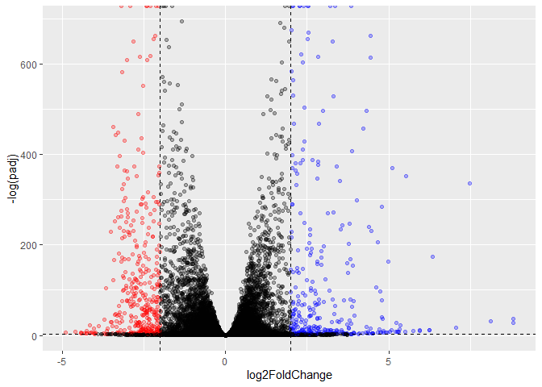

Lab13
================
Nate Tran

# Reading and Exploring Data

Loading in counts and meta data and confirming that they match.

``` r
meta <- read.csv("GSE37704_metadata.csv")
counts <- read.csv("GSE37704_featurecounts.csv", row.names=1)

counts <- counts[,meta$id]

all.equal(meta$id, colnames(counts))
```

    [1] TRUE

Excluding zero count genes (genes with 0 counts in EVERY sample)

``` r
counts <- counts[!rowSums(counts)==0,]
```

# PCA Quality Check

``` r
pca <- prcomp(t(counts), scale=T)
summary(pca)
```

    Importance of components:
                               PC1     PC2      PC3      PC4      PC5       PC6
    Standard deviation     87.7211 73.3196 32.89604 31.15094 29.18417 6.648e-13
    Proportion of Variance  0.4817  0.3365  0.06774  0.06074  0.05332 0.000e+00
    Cumulative Proportion   0.4817  0.8182  0.88594  0.94668  1.00000 1.000e+00

Using ggplot to visualize PCA results

``` r
library(ggplot2)
library(ggrepel)

ggplot(as.data.frame(pca$x)) +
  aes(PC1, PC2, color = meta$condition) +
  geom_point() +
  geom_text_repel(label = meta$condition) +
  xlab("PC1 (48.2% of variance)") +
  ylab("PC2 (33.7% of variance)")
```


There seems to be a clear distinction between controls and HOXA1 KD
samples. Great success!

# DESeq Analysis

Running DESeq on input counts and meta data

``` r
library(DESeq2)
```

    Loading required package: S4Vectors

    Loading required package: stats4

    Loading required package: BiocGenerics


    Attaching package: 'BiocGenerics'

    The following objects are masked from 'package:stats':

        IQR, mad, sd, var, xtabs

    The following objects are masked from 'package:base':

        anyDuplicated, aperm, append, as.data.frame, basename, cbind,
        colnames, dirname, do.call, duplicated, eval, evalq, Filter, Find,
        get, grep, grepl, intersect, is.unsorted, lapply, Map, mapply,
        match, mget, order, paste, pmax, pmax.int, pmin, pmin.int,
        Position, rank, rbind, Reduce, rownames, sapply, setdiff, sort,
        table, tapply, union, unique, unsplit, which.max, which.min


    Attaching package: 'S4Vectors'

    The following objects are masked from 'package:base':

        expand.grid, I, unname

    Loading required package: IRanges


    Attaching package: 'IRanges'

    The following object is masked from 'package:grDevices':

        windows

    Loading required package: GenomicRanges

    Loading required package: GenomeInfoDb

    Loading required package: SummarizedExperiment

    Loading required package: MatrixGenerics

    Loading required package: matrixStats


    Attaching package: 'MatrixGenerics'

    The following objects are masked from 'package:matrixStats':

        colAlls, colAnyNAs, colAnys, colAvgsPerRowSet, colCollapse,
        colCounts, colCummaxs, colCummins, colCumprods, colCumsums,
        colDiffs, colIQRDiffs, colIQRs, colLogSumExps, colMadDiffs,
        colMads, colMaxs, colMeans2, colMedians, colMins, colOrderStats,
        colProds, colQuantiles, colRanges, colRanks, colSdDiffs, colSds,
        colSums2, colTabulates, colVarDiffs, colVars, colWeightedMads,
        colWeightedMeans, colWeightedMedians, colWeightedSds,
        colWeightedVars, rowAlls, rowAnyNAs, rowAnys, rowAvgsPerColSet,
        rowCollapse, rowCounts, rowCummaxs, rowCummins, rowCumprods,
        rowCumsums, rowDiffs, rowIQRDiffs, rowIQRs, rowLogSumExps,
        rowMadDiffs, rowMads, rowMaxs, rowMeans2, rowMedians, rowMins,
        rowOrderStats, rowProds, rowQuantiles, rowRanges, rowRanks,
        rowSdDiffs, rowSds, rowSums2, rowTabulates, rowVarDiffs, rowVars,
        rowWeightedMads, rowWeightedMeans, rowWeightedMedians,
        rowWeightedSds, rowWeightedVars

    Loading required package: Biobase

    Welcome to Bioconductor

        Vignettes contain introductory material; view with
        'browseVignettes()'. To cite Bioconductor, see
        'citation("Biobase")', and for packages 'citation("pkgname")'.


    Attaching package: 'Biobase'

    The following object is masked from 'package:MatrixGenerics':

        rowMedians

    The following objects are masked from 'package:matrixStats':

        anyMissing, rowMedians

``` r
dds <- DESeqDataSetFromMatrix(counts, meta, ~condition)
```

    Warning in DESeqDataSet(se, design = design, ignoreRank): some variables in
    design formula are characters, converting to factors

``` r
dds <- DESeq(dds)
```

    estimating size factors

    estimating dispersions

    gene-wise dispersion estimates

    mean-dispersion relationship

    final dispersion estimates

    fitting model and testing

Extracting results from DESeq analysis

``` r
res <- results(dds)
head(res)
```

    log2 fold change (MLE): condition hoxa1 kd vs control sirna 
    Wald test p-value: condition hoxa1 kd vs control sirna 
    DataFrame with 6 rows and 6 columns
                     baseMean log2FoldChange     lfcSE       stat      pvalue
                    <numeric>      <numeric> <numeric>  <numeric>   <numeric>
    ENSG00000279457   29.9136      0.1792571 0.3248216   0.551863 5.81042e-01
    ENSG00000187634  183.2296      0.4264571 0.1402658   3.040350 2.36304e-03
    ENSG00000188976 1651.1881     -0.6927205 0.0548465 -12.630158 1.43990e-36
    ENSG00000187961  209.6379      0.7297556 0.1318599   5.534326 3.12428e-08
    ENSG00000187583   47.2551      0.0405765 0.2718928   0.149237 8.81366e-01
    ENSG00000187642   11.9798      0.5428105 0.5215598   1.040744 2.97994e-01
                           padj
                      <numeric>
    ENSG00000279457 6.86555e-01
    ENSG00000187634 5.15718e-03
    ENSG00000188976 1.76549e-35
    ENSG00000187961 1.13413e-07
    ENSG00000187583 9.19031e-01
    ENSG00000187642 4.03379e-01

# Plotting DESeq Results

Creating color vector to differentiate upregulated and downregulated
genes.

``` r
my_colors <- rep("black", nrow(res))
my_colors[res$log2FoldChange > 2 & res$padj < 0.05] <- "blue"
my_colors[res$log2FoldChange < -2 & res$padj < 0.05] <- "red"
```

Plotting results in summary volcano plot.

``` r
ggplot(as.data.frame(res)) +
  aes(log2FoldChange, -log(padj)) +
  geom_point(color=my_colors, alpha=0.3) +
  geom_vline(xintercept = c(-2,2), linetype="dashed") +
  geom_hline(yintercept=-log(0.05), linetype="dashed")
```

    Warning: Removed 1237 rows containing missing values (`geom_point()`).



# Adding Annotation Data

Loading in annotation data libraries

``` r
library("AnnotationDbi")
library("org.Hs.eg.db")
```

Mapping alternative IDs to entries in DESeq results (gene names,
symbols, entrez, uniprot)

``` r
res$gene <- mapIds(org.Hs.eg.db, keys=rownames(res), keytype="ENSEMBL", column="GENENAME", multiVals="first")
```

    'select()' returned 1:many mapping between keys and columns

``` r
res$symbol <- mapIds(org.Hs.eg.db, keys=rownames(res), keytype="ENSEMBL", column="SYMBOL", multiVals="first")
```

    'select()' returned 1:many mapping between keys and columns

``` r
res$entrez <- mapIds(org.Hs.eg.db, keys=rownames(res), keytype="ENSEMBL", column="ENTREZID", multiVals="first")
```

    'select()' returned 1:many mapping between keys and columns

``` r
res$uniprot <- mapIds(org.Hs.eg.db, keys=rownames(res), keytype="ENSEMBL", column="GENENAME", multiVals="first")
```

    'select()' returned 1:many mapping between keys and columns

Re-plotting volcano plot with annotation tags

``` r
res_df <- as.data.frame(res)
ggplot(as.data.frame(res)) +
  aes(log2FoldChange, -log(padj), label = symbol) +
  geom_point(color=my_colors, alpha=0.3) +
  geom_vline(xintercept = c(-2,2), linetype="dashed", color = "red") +
  geom_hline(yintercept=-log(0.05), linetype="dashed", color = "red") +
  geom_text_repel(data=subset(res_df, (res$log2FoldChange > 2 | res$log2FoldChange < -2) & res$padj < 0.05))
```

    Warning: Removed 1237 rows containing missing values (`geom_point()`).

    Warning: Removed 2 rows containing missing values (`geom_text_repel()`).

    Warning: ggrepel: 621 unlabeled data points (too many overlaps). Consider
    increasing max.overlaps


# Pathway Analysis: KEGG

``` r
FC <- res_df$log2FoldChange
names(FC) <- res_df$entrez
```

Loading in necessary packages

``` r
#/ message: false
library(gage)
```

``` r
library(gageData)
library(pathview)
```

    ##############################################################################
    Pathview is an open source software package distributed under GNU General
    Public License version 3 (GPLv3). Details of GPLv3 is available at
    http://www.gnu.org/licenses/gpl-3.0.html. Particullary, users are required to
    formally cite the original Pathview paper (not just mention it) in publications
    or products. For details, do citation("pathview") within R.

    The pathview downloads and uses KEGG data. Non-academic uses may require a KEGG
    license agreement (details at http://www.kegg.jp/kegg/legal.html).
    ##############################################################################

Using GAGE to do pathway analysis using KEGG database of human
pathways/processes

``` r
data(kegg.sets.hs)

kegg <- gage(FC, gsets=kegg.sets.hs)
head(kegg$less)
```

                                                      p.geomean stat.mean
    hsa04110 Cell cycle                            8.995727e-06 -4.378644
    hsa03030 DNA replication                       9.424076e-05 -3.951803
    hsa05130 Pathogenic Escherichia coli infection 1.405864e-04 -3.765330
    hsa03013 RNA transport                         1.246882e-03 -3.059466
    hsa03440 Homologous recombination              3.066756e-03 -2.852899
    hsa04114 Oocyte meiosis                        3.784520e-03 -2.698128
                                                          p.val       q.val
    hsa04110 Cell cycle                            8.995727e-06 0.001889103
    hsa03030 DNA replication                       9.424076e-05 0.009841047
    hsa05130 Pathogenic Escherichia coli infection 1.405864e-04 0.009841047
    hsa03013 RNA transport                         1.246882e-03 0.065461279
    hsa03440 Homologous recombination              3.066756e-03 0.128803765
    hsa04114 Oocyte meiosis                        3.784520e-03 0.132458191
                                                   set.size         exp1
    hsa04110 Cell cycle                                 121 8.995727e-06
    hsa03030 DNA replication                             36 9.424076e-05
    hsa05130 Pathogenic Escherichia coli infection       53 1.405864e-04
    hsa03013 RNA transport                              144 1.246882e-03
    hsa03440 Homologous recombination                    28 3.066756e-03
    hsa04114 Oocyte meiosis                             102 3.784520e-03

``` r
head(kegg$greater)
```

                                                       p.geomean stat.mean
    hsa04060 Cytokine-cytokine receptor interaction 9.131044e-06  4.358967
    hsa05323 Rheumatoid arthritis                   1.809824e-04  3.666793
    hsa05146 Amoebiasis                             1.313400e-03  3.052596
    hsa05332 Graft-versus-host disease              2.605234e-03  2.948229
    hsa04640 Hematopoietic cell lineage             2.822776e-03  2.833362
    hsa04630 Jak-STAT signaling pathway             5.202070e-03  2.585673
                                                           p.val       q.val
    hsa04060 Cytokine-cytokine receptor interaction 9.131044e-06 0.001917519
    hsa05323 Rheumatoid arthritis                   1.809824e-04 0.019003147
    hsa05146 Amoebiasis                             1.313400e-03 0.091937999
    hsa05332 Graft-versus-host disease              2.605234e-03 0.118556573
    hsa04640 Hematopoietic cell lineage             2.822776e-03 0.118556573
    hsa04630 Jak-STAT signaling pathway             5.202070e-03 0.182072434
                                                    set.size         exp1
    hsa04060 Cytokine-cytokine receptor interaction      177 9.131044e-06
    hsa05323 Rheumatoid arthritis                         72 1.809824e-04
    hsa05146 Amoebiasis                                   94 1.313400e-03
    hsa05332 Graft-versus-host disease                    22 2.605234e-03
    hsa04640 Hematopoietic cell lineage                   55 2.822776e-03
    hsa04630 Jak-STAT signaling pathway                  109 5.202070e-03

Using pathview to visualize some affected pathways e.g. cell cycle and
cytokine-cytokine receptor interactions

``` r
pathview(gene.data=FC, pathway.id="hsa04110")
```

    'select()' returned 1:1 mapping between keys and columns

    Info: Working in directory C:/Users/Nate Tran/Documents/RStudioWorkspace/bggn213_github/class13

    Info: Writing image file hsa04110.pathview.png


``` r
pathview(gene.data=FC, pathway.id="hsa04060")
```

    'select()' returned 1:1 mapping between keys and columns

    Info: Working in directory C:/Users/Nate Tran/Documents/RStudioWorkspace/bggn213_github/class13

    Info: Writing image file hsa04060.pathview.png


# Pathway Analysis: GO

Using GAGE to do pathway analysis using GO database of processes

``` r
data(go.sets.hs)

go <- gage(FC, gsets=go.sets.hs)
```

Exploring GO analysis

``` r
head(go$greater)
```

                                                                                                p.geomean
    GO:0007156 homophilic cell adhesion                                                      8.519724e-05
    GO:0005125 cytokine activity                                                             1.141426e-04
    GO:0002009 morphogenesis of an epithelium                                                1.396681e-04
    GO:0048729 tissue morphogenesis                                                          1.432451e-04
    GO:0000981 sequence-specific DNA binding RNA polymerase II transcription factor activity 1.937641e-04
    GO:0007610 behavior                                                                      2.195494e-04
                                                                                             stat.mean
    GO:0007156 homophilic cell adhesion                                                       3.824205
    GO:0005125 cytokine activity                                                              3.751087
    GO:0002009 morphogenesis of an epithelium                                                 3.653886
    GO:0048729 tissue morphogenesis                                                           3.643242
    GO:0000981 sequence-specific DNA binding RNA polymerase II transcription factor activity  3.580295
    GO:0007610 behavior                                                                       3.530241
                                                                                                    p.val
    GO:0007156 homophilic cell adhesion                                                      8.519724e-05
    GO:0005125 cytokine activity                                                             1.141426e-04
    GO:0002009 morphogenesis of an epithelium                                                1.396681e-04
    GO:0048729 tissue morphogenesis                                                          1.432451e-04
    GO:0000981 sequence-specific DNA binding RNA polymerase II transcription factor activity 1.937641e-04
    GO:0007610 behavior                                                                      2.195494e-04
                                                                                                 q.val
    GO:0007156 homophilic cell adhesion                                                      0.1937748
    GO:0005125 cytokine activity                                                             0.1937748
    GO:0002009 morphogenesis of an epithelium                                                0.1937748
    GO:0048729 tissue morphogenesis                                                          0.1937748
    GO:0000981 sequence-specific DNA binding RNA polymerase II transcription factor activity 0.1979970
    GO:0007610 behavior                                                                      0.1979970
                                                                                             set.size
    GO:0007156 homophilic cell adhesion                                                           113
    GO:0005125 cytokine activity                                                                  130
    GO:0002009 morphogenesis of an epithelium                                                     339
    GO:0048729 tissue morphogenesis                                                               424
    GO:0000981 sequence-specific DNA binding RNA polymerase II transcription factor activity      201
    GO:0007610 behavior                                                                           427
                                                                                                     exp1
    GO:0007156 homophilic cell adhesion                                                      8.519724e-05
    GO:0005125 cytokine activity                                                             1.141426e-04
    GO:0002009 morphogenesis of an epithelium                                                1.396681e-04
    GO:0048729 tissue morphogenesis                                                          1.432451e-04
    GO:0000981 sequence-specific DNA binding RNA polymerase II transcription factor activity 1.937641e-04
    GO:0007610 behavior                                                                      2.195494e-04

``` r
head(go$less)
```

                                                 p.geomean stat.mean        p.val
    GO:0048285 organelle fission              1.536227e-15 -8.063910 1.536227e-15
    GO:0000280 nuclear division               4.286961e-15 -7.939217 4.286961e-15
    GO:0007067 mitosis                        4.286961e-15 -7.939217 4.286961e-15
    GO:0000087 M phase of mitotic cell cycle  1.169934e-14 -7.797496 1.169934e-14
    GO:0007059 chromosome segregation         2.028624e-11 -6.878340 2.028624e-11
    GO:0000775 chromosome, centromeric region 2.131309e-11 -6.863475 2.131309e-11
                                                     q.val set.size         exp1
    GO:0048285 organelle fission              7.732248e-12      376 1.536227e-15
    GO:0000280 nuclear division               7.732248e-12      352 4.286961e-15
    GO:0007067 mitosis                        7.732248e-12      352 4.286961e-15
    GO:0000087 M phase of mitotic cell cycle  1.582628e-11      362 1.169934e-14
    GO:0007059 chromosome segregation         1.922085e-08      142 2.028624e-11
    GO:0000775 chromosome, centromeric region 1.922085e-08      146 2.131309e-11

# Reactome Analysis

``` r
sig_genes <- res[res$padj <= 0.05 & !is.na(res$padj), "symbol"]
print(paste("Total number of significant genes:", length(sig_genes)))
```

    [1] "Total number of significant genes: 8147"

Writing significantly altered genes to table file for export.

``` r
write.table(sig_genes, file="significant_genes.txt", row.names=FALSE, col.names=FALSE, quote=FALSE)
```
