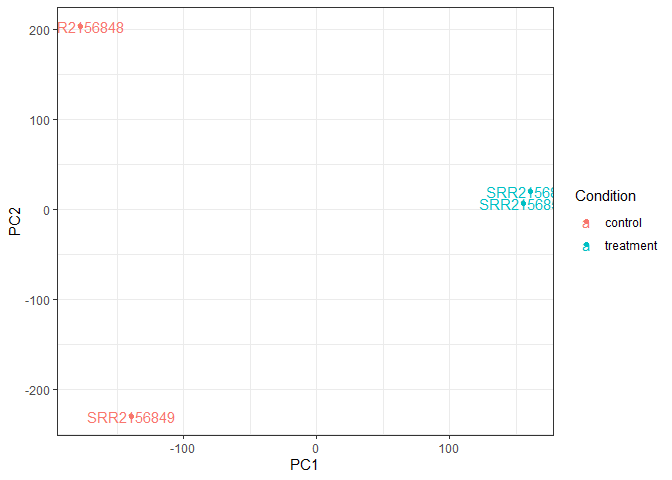
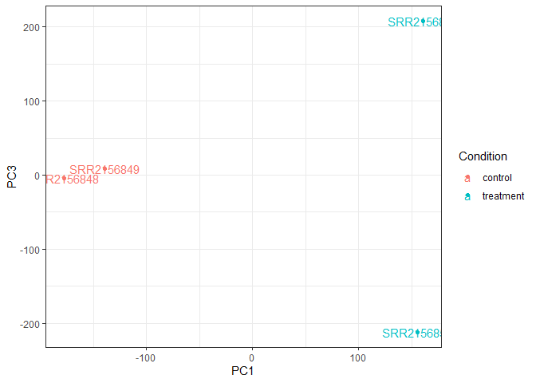
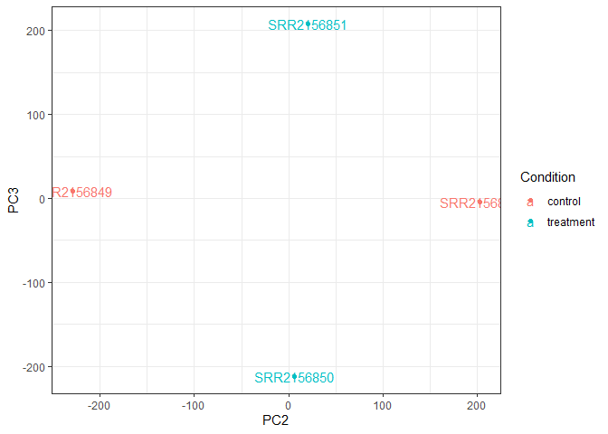
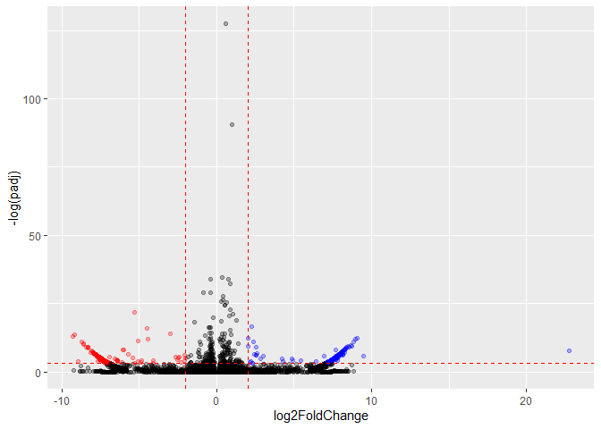

lab16
================
Nate Tran

Reading in data using tximport

``` r
library(tximport)
library(rhdf5)

folders <- dir(pattern="SRR21568*")
samples <- sub("_quant", "", folders)
files <- file.path( folders, "abundance.h5" )
names(files) <- samples

txi.kallisto <- tximport(files, type = "kallisto", txOut = TRUE)
```

    1 2 3 4 

Filtering for transcripts with no reads in any sample or with no change
over any samples

``` r
data_idx <- rowSums(txi.kallisto$counts) > 0
data <- txi.kallisto$counts[data_idx,]

data_idx2 <- apply(data, 1, sd) > 0
data2 <- data[data_idx2,]
```

Running PCA

``` r
pca_data2 <- prcomp(t(data2), scale=T)
```

Plotting PCA Results

``` r
library(ggplot2)

columns <- data.frame(condition = factor(rep(c("control", "treatment"), each = 2)))
rownames(columns) <- colnames(txi.kallisto$counts)

input <- as.data.frame(pca_data2$x)
input$Condition <- as.factor(columns$condition)

ggplot(input) +
  aes(PC1, PC2, col=Condition) +
  geom_point() +
  geom_text(label=rownames(input)) +
  theme_bw()
```



``` r
ggplot(input) +
  aes(PC1, PC3, col=Condition) +
  geom_point() +
  geom_text(label=rownames(input)) +
  theme_bw()
```



``` r
ggplot(input) +
  aes(PC2, PC3, col=Condition) +
  geom_point() +
  geom_text(label=rownames(input)) +
  theme_bw()
```



Using DESeq2 for Differential Gene Expression Analysis

``` r
library(DESeq2)
```

    Loading required package: S4Vectors

    Loading required package: stats4

    Loading required package: BiocGenerics


    Attaching package: 'BiocGenerics'

    The following objects are masked from 'package:stats':

        IQR, mad, sd, var, xtabs

    The following objects are masked from 'package:base':

        anyDuplicated, aperm, append, as.data.frame, basename, cbind,
        colnames, dirname, do.call, duplicated, eval, evalq, Filter, Find,
        get, grep, grepl, intersect, is.unsorted, lapply, Map, mapply,
        match, mget, order, paste, pmax, pmax.int, pmin, pmin.int,
        Position, rank, rbind, Reduce, rownames, sapply, setdiff, sort,
        table, tapply, union, unique, unsplit, which.max, which.min


    Attaching package: 'S4Vectors'

    The following objects are masked from 'package:base':

        expand.grid, I, unname

    Loading required package: IRanges


    Attaching package: 'IRanges'

    The following object is masked from 'package:grDevices':

        windows

    Loading required package: GenomicRanges

    Loading required package: GenomeInfoDb

    Loading required package: SummarizedExperiment

    Loading required package: MatrixGenerics

    Loading required package: matrixStats


    Attaching package: 'MatrixGenerics'

    The following objects are masked from 'package:matrixStats':

        colAlls, colAnyNAs, colAnys, colAvgsPerRowSet, colCollapse,
        colCounts, colCummaxs, colCummins, colCumprods, colCumsums,
        colDiffs, colIQRDiffs, colIQRs, colLogSumExps, colMadDiffs,
        colMads, colMaxs, colMeans2, colMedians, colMins, colOrderStats,
        colProds, colQuantiles, colRanges, colRanks, colSdDiffs, colSds,
        colSums2, colTabulates, colVarDiffs, colVars, colWeightedMads,
        colWeightedMeans, colWeightedMedians, colWeightedSds,
        colWeightedVars, rowAlls, rowAnyNAs, rowAnys, rowAvgsPerColSet,
        rowCollapse, rowCounts, rowCummaxs, rowCummins, rowCumprods,
        rowCumsums, rowDiffs, rowIQRDiffs, rowIQRs, rowLogSumExps,
        rowMadDiffs, rowMads, rowMaxs, rowMeans2, rowMedians, rowMins,
        rowOrderStats, rowProds, rowQuantiles, rowRanges, rowRanks,
        rowSdDiffs, rowSds, rowSums2, rowTabulates, rowVarDiffs, rowVars,
        rowWeightedMads, rowWeightedMeans, rowWeightedMedians,
        rowWeightedSds, rowWeightedVars

    Loading required package: Biobase

    Welcome to Bioconductor

        Vignettes contain introductory material; view with
        'browseVignettes()'. To cite Bioconductor, see
        'citation("Biobase")', and for packages 'citation("pkgname")'.


    Attaching package: 'Biobase'

    The following object is masked from 'package:MatrixGenerics':

        rowMedians

    The following objects are masked from 'package:matrixStats':

        anyMissing, rowMedians

``` r
test <- data.frame(condition = factor(rep(c("control", "treatment"), each = 2)))
rownames(test) <- colnames(txi.kallisto$counts)

#confirm that rownames of colData and colnames of countsData are the same

all.equal(rownames(test), colnames(txi.kallisto$counts))
```

    [1] TRUE

``` r
dds <- DESeqDataSetFromTximport(txi.kallisto, test, ~condition)
```

    using counts and average transcript lengths from tximport

``` r
dds <- DESeq(dds)
```

    estimating size factors

    using 'avgTxLength' from assays(dds), correcting for library size

    estimating dispersions

    gene-wise dispersion estimates

    mean-dispersion relationship

    -- note: fitType='parametric', but the dispersion trend was not well captured by the
       function: y = a/x + b, and a local regression fit was automatically substituted.
       specify fitType='local' or 'mean' to avoid this message next time.

    final dispersion estimates

    fitting model and testing

Viewing results of DESeq analysis

``` r
res <- results(dds)

library(ggrepel)

colors_DE <- rep("black", nrow(res))
colors_DE[res$log2FoldChange > 2 & res$padj < 0.05] <- "blue"
colors_DE[res$log2FoldChange < -2 & res$padj < 0.05] <- "red"

res_df <- as.data.frame(res)

ggplot(res_df) +
  aes(log2FoldChange, -log(padj)) +
  geom_point(color=colors_DE, alpha=0.3) +
  geom_vline(xintercept = c(-2,2), linetype="dashed", color = "red") +
  geom_hline(yintercept=-log(0.05), linetype="dashed", color = "red")
```

    Warning: Removed 147246 rows containing missing values (`geom_point()`).


