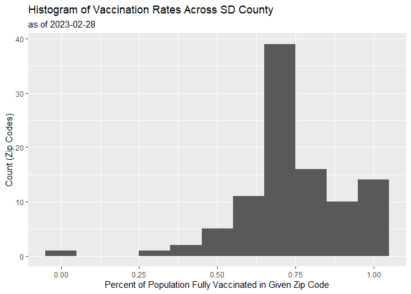
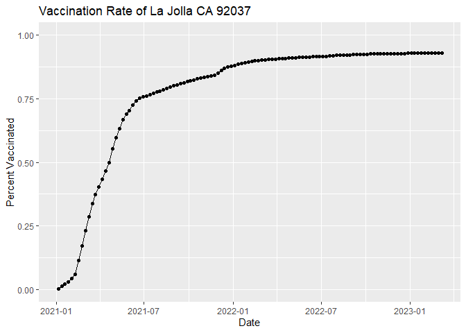
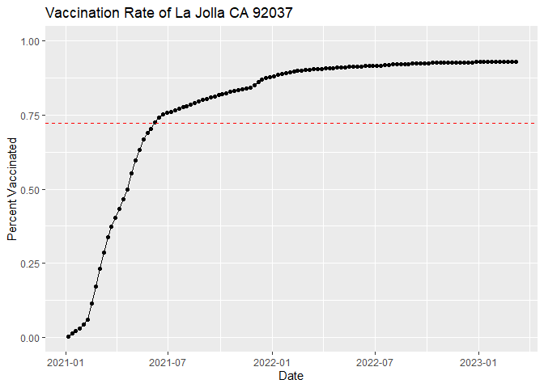
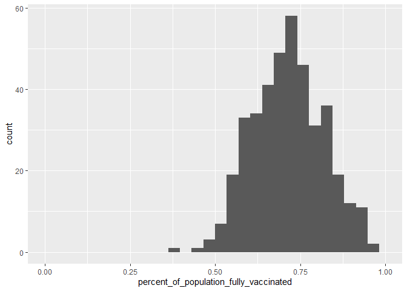
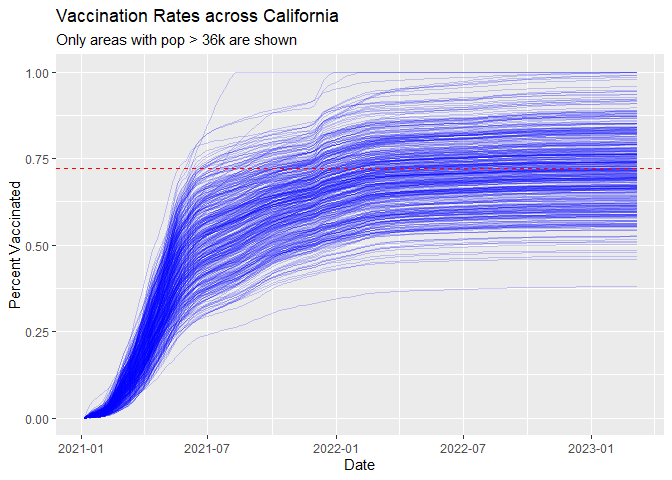

lab17
================
Nate Tran

# Importing and Exploring Data

``` r
vax <- read.csv("covid19vaccinesbyzipcode_test.csv")
head(vax)
```

      as_of_date zip_code_tabulation_area local_health_jurisdiction          county
    1 2021-01-05                    93609                    Fresno          Fresno
    2 2021-01-05                    94086               Santa Clara     Santa Clara
    3 2021-01-05                    94304               Santa Clara     Santa Clara
    4 2021-01-05                    94110             San Francisco   San Francisco
    5 2021-01-05                    93420           San Luis Obispo San Luis Obispo
    6 2021-01-05                    93454             Santa Barbara   Santa Barbara
      vaccine_equity_metric_quartile                 vem_source
    1                              1 Healthy Places Index Score
    2                              4 Healthy Places Index Score
    3                              4 Healthy Places Index Score
    4                              4 Healthy Places Index Score
    5                              3 Healthy Places Index Score
    6                              2 Healthy Places Index Score
      age12_plus_population age5_plus_population tot_population
    1                4396.3                 4839           5177
    2               42696.0                46412          50477
    3                3263.5                 3576           3852
    4               64350.7                68320          72380
    5               26694.9                29253          30740
    6               32043.4                36446          40432
      persons_fully_vaccinated persons_partially_vaccinated
    1                       NA                           NA
    2                       11                          640
    3                       NA                           NA
    4                       18                         1262
    5                       NA                           NA
    6                       NA                           NA
      percent_of_population_fully_vaccinated
    1                                     NA
    2                               0.000218
    3                                     NA
    4                               0.000249
    5                                     NA
    6                                     NA
      percent_of_population_partially_vaccinated
    1                                         NA
    2                                   0.012679
    3                                         NA
    4                                   0.017436
    5                                         NA
    6                                         NA
      percent_of_population_with_1_plus_dose booster_recip_count
    1                                     NA                  NA
    2                               0.012897                  NA
    3                                     NA                  NA
    4                               0.017685                  NA
    5                                     NA                  NA
    6                                     NA                  NA
      bivalent_dose_recip_count eligible_recipient_count
    1                        NA                        1
    2                        NA                       11
    3                        NA                        6
    4                        NA                       18
    5                        NA                        4
    6                        NA                        5
                                                                   redacted
    1 Information redacted in accordance with CA state privacy requirements
    2 Information redacted in accordance with CA state privacy requirements
    3 Information redacted in accordance with CA state privacy requirements
    4 Information redacted in accordance with CA state privacy requirements
    5 Information redacted in accordance with CA state privacy requirements
    6 Information redacted in accordance with CA state privacy requirements

``` r
tail(vax)
```

           as_of_date zip_code_tabulation_area local_health_jurisdiction
    201091 2023-03-07                    93662                    Fresno
    201092 2023-03-07                    94801              Contra Costa
    201093 2023-03-07                    93668                    Fresno
    201094 2023-03-07                    93704                    Fresno
    201095 2023-03-07                    94510                    Solano
    201096 2023-03-07                    93726                    Fresno
                 county vaccine_equity_metric_quartile                 vem_source
    201091       Fresno                              1 Healthy Places Index Score
    201092 Contra Costa                              1 Healthy Places Index Score
    201093       Fresno                              1    CDPH-Derived ZCTA Score
    201094       Fresno                              1 Healthy Places Index Score
    201095       Solano                              4 Healthy Places Index Score
    201096       Fresno                              1 Healthy Places Index Score
           age12_plus_population age5_plus_population tot_population
    201091               24501.3                28311          30725
    201092               25273.6                29040          31210
    201093                1013.4                 1199           1219
    201094               24803.5                27701          29740
    201095               24819.2                27056          28350
    201096               33707.7                39067          42824
           persons_fully_vaccinated persons_partially_vaccinated
    201091                    20088                         2150
    201092                    27375                         2309
    201093                      644                           74
    201094                    17887                         1735
    201095                    22648                         2264
    201096                    24121                         2682
           percent_of_population_fully_vaccinated
    201091                               0.653800
    201092                               0.877123
    201093                               0.528302
    201094                               0.601446
    201095                               0.798871
    201096                               0.563259
           percent_of_population_partially_vaccinated
    201091                                   0.069976
    201092                                   0.073983
    201093                                   0.060705
    201094                                   0.058339
    201095                                   0.079859
    201096                                   0.062628
           percent_of_population_with_1_plus_dose booster_recip_count
    201091                               0.723776               10072
    201092                               0.951106               14782
    201093                               0.589007                 312
    201094                               0.659785               10435
    201095                               0.878730               16092
    201096                               0.625887               12104
           bivalent_dose_recip_count eligible_recipient_count redacted
    201091                      2578                    20066       No
    201092                      5342                    27282       No
    201093                        66                      644       No
    201094                      4154                    17822       No
    201095                      8797                    22501       No
    201096                      3585                    24062       No

## Q1

persons_fully_vaccinated column

## Q2

zip_code_tabulation_area column

## Q3

Earliest date is 01/05/2021 or 2021-01-05

## Q4

Latest date is 03/07/2023 or 2023-03-07

``` r
skimr::skim(vax)
```

|                                                  |        |
|:-------------------------------------------------|:-------|
| Name                                             | vax    |
| Number of rows                                   | 201096 |
| Number of columns                                | 18     |
| \_\_\_\_\_\_\_\_\_\_\_\_\_\_\_\_\_\_\_\_\_\_\_   |        |
| Column type frequency:                           |        |
| character                                        | 5      |
| numeric                                          | 13     |
| \_\_\_\_\_\_\_\_\_\_\_\_\_\_\_\_\_\_\_\_\_\_\_\_ |        |
| Group variables                                  | None   |

Data summary

**Variable type: character**

| skim_variable             | n_missing | complete_rate | min | max | empty | n_unique | whitespace |
|:--------------------------|----------:|--------------:|----:|----:|------:|---------:|-----------:|
| as_of_date                |         0 |             1 |  10 |  10 |     0 |      114 |          0 |
| local_health_jurisdiction |         0 |             1 |   0 |  15 |   570 |       62 |          0 |
| county                    |         0 |             1 |   0 |  15 |   570 |       59 |          0 |
| vem_source                |         0 |             1 |  15 |  26 |     0 |        3 |          0 |
| redacted                  |         0 |             1 |   2 |  69 |     0 |        2 |          0 |

**Variable type: numeric**

| skim_variable                              | n_missing | complete_rate |     mean |       sd |    p0 |      p25 |      p50 |      p75 |     p100 | hist  |
|:-------------------------------------------|----------:|--------------:|---------:|---------:|------:|---------:|---------:|---------:|---------:|:------|
| zip_code_tabulation_area                   |         0 |          1.00 | 93665.11 |  1817.38 | 90001 | 92257.75 | 93658.50 | 95380.50 |  97635.0 | ▃▅▅▇▁ |
| vaccine_equity_metric_quartile             |      9918 |          0.95 |     2.44 |     1.11 |     1 |     1.00 |     2.00 |     3.00 |      4.0 | ▇▇▁▇▇ |
| age12_plus_population                      |         0 |          1.00 | 18895.04 | 18993.87 |     0 |  1346.95 | 13685.10 | 31756.12 |  88556.7 | ▇▃▂▁▁ |
| age5_plus_population                       |         0 |          1.00 | 20875.24 | 21105.97 |     0 |  1460.50 | 15364.00 | 34877.00 | 101902.0 | ▇▃▂▁▁ |
| tot_population                             |      9804 |          0.95 | 23372.77 | 22628.50 |    12 |  2126.00 | 18714.00 | 38168.00 | 111165.0 | ▇▅▂▁▁ |
| persons_fully_vaccinated                   |     16621 |          0.92 | 13990.39 | 15073.66 |    11 |   932.00 |  8589.00 | 23346.00 |  87575.0 | ▇▃▁▁▁ |
| persons_partially_vaccinated               |     16621 |          0.92 |  1702.31 |  2033.32 |    11 |   165.00 |  1197.00 |  2536.00 |  39973.0 | ▇▁▁▁▁ |
| percent_of_population_fully_vaccinated     |     20965 |          0.90 |     0.57 |     0.25 |     0 |     0.42 |     0.61 |     0.74 |      1.0 | ▂▃▆▇▃ |
| percent_of_population_partially_vaccinated |     20965 |          0.90 |     0.08 |     0.09 |     0 |     0.05 |     0.06 |     0.08 |      1.0 | ▇▁▁▁▁ |
| percent_of_population_with_1\_plus_dose    |     22009 |          0.89 |     0.63 |     0.24 |     0 |     0.49 |     0.67 |     0.81 |      1.0 | ▂▂▅▇▆ |
| booster_recip_count                        |     72997 |          0.64 |  5882.76 |  7219.00 |    11 |   300.00 |  2773.00 |  9510.00 |  59593.0 | ▇▂▁▁▁ |
| bivalent_dose_recip_count                  |    158776 |          0.21 |  2978.23 |  3633.03 |    11 |   193.00 |  1467.50 |  4730.25 |  27694.0 | ▇▂▁▁▁ |
| eligible_recipient_count                   |         0 |          1.00 | 12830.83 | 14928.64 |     0 |   507.00 |  6369.00 | 22014.00 |  87248.0 | ▇▃▁▁▁ |

## Q5

There are 13 numeric columns

``` r
sum(is.na(vax$persons_fully_vaccinated))
```

    [1] 16621

``` r
sum(is.na(vax$persons_fully_vaccinated))/nrow(vax)
```

    [1] 0.08265207

## Q6

There are 16621 NA values in persons_fully_vaccinated column

## Q7

8.3% of persons_fully_vaccinated values are missing

## Q8

The data might be missing because some counties may not have had
statistics taken at certain earlier dates e.g. 2021

# Working with Dates

``` r
library(lubridate)
```


    Attaching package: 'lubridate'

    The following objects are masked from 'package:base':

        date, intersect, setdiff, union

Converting date data into lubridate format

``` r
vax$as_of_date <-  ymd(vax$as_of_date)
```

Performing math with dates is possible now!

``` r
today() - vax$as_of_date[1]
```

    Time difference of 801 days

``` r
vax$as_of_date[nrow(vax)] - vax$as_of_date[1]
```

    Time difference of 791 days

``` r
length(unique(vax$as_of_date))
```

    [1] 114

## Q9

791 days have passed since the last update.

## Q10

There are 114 unique dates.

# Working with ZIP Codes

Using zipcodeR package for analysis of zip code data

``` r
library(zipcodeR)
```

``` r
geocode_zip("92037")
```

    # A tibble: 1 × 3
      zipcode   lat   lng
      <chr>   <dbl> <dbl>
    1 92037    32.8 -117.

``` r
zip_distance("92037", "92109")
```

      zipcode_a zipcode_b distance
    1     92037     92109     2.33

``` r
reverse_zipcode(c("92037", "92109"))
```

    # A tibble: 2 × 24
      zipcode zipcode_…¹ major…² post_…³ common_c…⁴ county state   lat   lng timez…⁵
      <chr>   <chr>      <chr>   <chr>       <blob> <chr>  <chr> <dbl> <dbl> <chr>  
    1 92037   Standard   La Jol… La Jol… <raw 20 B> San D… CA     32.8 -117. Pacific
    2 92109   Standard   San Di… San Di… <raw 21 B> San D… CA     32.8 -117. Pacific
    # … with 14 more variables: radius_in_miles <dbl>, area_code_list <blob>,
    #   population <int>, population_density <dbl>, land_area_in_sqmi <dbl>,
    #   water_area_in_sqmi <dbl>, housing_units <int>,
    #   occupied_housing_units <int>, median_home_value <int>,
    #   median_household_income <int>, bounds_west <dbl>, bounds_east <dbl>,
    #   bounds_north <dbl>, bounds_south <dbl>, and abbreviated variable names
    #   ¹​zipcode_type, ²​major_city, ³​post_office_city, ⁴​common_city_list, …

Pulling data for all zip codes in dataset

``` r
#data_zip <- reverse_zipcode(vax$zip_code_tabulation_area)
```

# Focus on the SD Area

Using dplyr package

``` r
library(dplyr)
```


    Attaching package: 'dplyr'

    The following objects are masked from 'package:stats':

        filter, lag

    The following objects are masked from 'package:base':

        intersect, setdiff, setequal, union

``` r
sd <- filter(vax, county == "San Diego")

nrow(sd)
```

    [1] 12198

``` r
sd_10k_pop <- filter(vax, county == "San Diego" & vax$age5_plus_population > 10000)
```

``` r
length(unique(sd$zip_code_tabulation_area))
```

    [1] 107

``` r
sd[which.max(sd$age12_plus_population),]$zip_code_tabulation_area
```

    [1] 92154

## Q11

There are 107 distinct zip codes listed for SD county.

## Q12

92154 has the largest 12+ population.

``` r
sd_2_28 <- filter(sd, sd$as_of_date == "2023-02-28")
```

``` r
sd_2_28_zeros <- sd_2_28
sd_2_28_zeros[is.na(sd_2_28$percent_of_population_fully_vaccinated),]$percent_of_population_fully_vaccinated <- 0
```

``` r
mean(sd_2_28_zeros$percent_of_population_fully_vaccinated)
```

    [1] 0.684829

## Q13

The average percent of population fully vaccinated is 68.48%.

## Q14

Summary figure below

``` r
library(ggplot2)
```

``` r
ggplot(sd_2_28) +
  aes(percent_of_population_fully_vaccinated) +
  geom_histogram(binwidth = .10) +
  labs(title = "Histogram of Vaccination Rates Across SD County", subtitle = "as of 2023-02-28") +
  xlab("Percent of Population Fully Vaccinated in Given Zip Code") +
  ylab("Count (Zip Codes)")
```

    Warning: Removed 8 rows containing non-finite values (`stat_bin()`).



# Focus on UCSD/La Jolla

``` r
ucsd <- filter(sd, zip_code_tabulation_area=="92037")
```

## Q15

Graph below

``` r
ggplot(ucsd) +
  aes(as_of_date, percent_of_population_fully_vaccinated) +
  geom_point() +
  geom_line(group=1) +
  ylim(c(0,1)) +
  labs(x="Date", y="Percent Vaccinated", title="Vaccination Rate of La Jolla CA 92037")
```



# Comparing UCSD to Similar Sized Areas

``` r
vax_compare <- filter(vax, vax$age5_plus_population > 36144 & as_of_date == "2023-02-28")
mean(vax_compare$percent_of_population_fully_vaccinated)
```

    [1] 0.7213907

## Q16

See below

``` r
ggplot(ucsd) +
  aes(as_of_date, percent_of_population_fully_vaccinated) +
  geom_point() +
  geom_line(group=1) +
  ylim(c(0,1)) +
  labs(x="Date", y="Percent Vaccinated", title="Vaccination Rate of La Jolla CA 92037") +
  geom_hline(yintercept = 0.7213907, linetype="dashed", col="red")
```



``` r
skimr::skim(vax_compare)
```

|                                                  |             |
|:-------------------------------------------------|:------------|
| Name                                             | vax_compare |
| Number of rows                                   | 411         |
| Number of columns                                | 18          |
| \_\_\_\_\_\_\_\_\_\_\_\_\_\_\_\_\_\_\_\_\_\_\_   |             |
| Column type frequency:                           |             |
| character                                        | 4           |
| Date                                             | 1           |
| numeric                                          | 13          |
| \_\_\_\_\_\_\_\_\_\_\_\_\_\_\_\_\_\_\_\_\_\_\_\_ |             |
| Group variables                                  | None        |

Data summary

**Variable type: character**

| skim_variable             | n_missing | complete_rate | min | max | empty | n_unique | whitespace |
|:--------------------------|----------:|--------------:|----:|----:|------:|---------:|-----------:|
| local_health_jurisdiction |         0 |             1 |   4 |  15 |     0 |       37 |          0 |
| county                    |         0 |             1 |   4 |  15 |     0 |       36 |          0 |
| vem_source                |         0 |             1 |  26 |  26 |     0 |        1 |          0 |
| redacted                  |         0 |             1 |   2 |   2 |     0 |        1 |          0 |

**Variable type: Date**

| skim_variable | n_missing | complete_rate | min        | max        | median     | n_unique |
|:--------------|----------:|--------------:|:-----------|:-----------|:-----------|---------:|
| as_of_date    |         0 |             1 | 2023-02-28 | 2023-02-28 | 2023-02-28 |        1 |

**Variable type: numeric**

| skim_variable                              | n_missing | complete_rate |     mean |       sd |       p0 |      p25 |      p50 |      p75 |     p100 | hist  |
|:-------------------------------------------|----------:|--------------:|---------:|---------:|---------:|---------:|---------:|---------:|---------:|:------|
| zip_code_tabulation_area                   |         0 |             1 | 92862.10 |  1716.60 | 90001.00 | 91761.50 | 92646.00 | 94517.00 |  96003.0 | ▆▇▇▅▆ |
| vaccine_equity_metric_quartile             |         0 |             1 |     2.35 |     1.11 |     1.00 |     1.00 |     2.00 |     3.00 |      4.0 | ▇▇▁▆▆ |
| age12_plus_population                      |         0 |             1 | 46847.40 | 12057.32 | 31650.90 | 37693.55 | 43985.40 | 53931.50 |  88556.7 | ▇▅▂▁▁ |
| age5_plus_population                       |         0 |             1 | 52012.32 | 13620.19 | 36181.00 | 41612.50 | 48573.00 | 59167.50 | 101902.0 | ▇▅▂▁▁ |
| tot_population                             |         0 |             1 | 55640.91 | 14745.19 | 38007.00 | 44393.00 | 52212.00 | 62910.00 | 111165.0 | ▇▅▂▁▁ |
| persons_fully_vaccinated                   |         0 |             1 | 40059.20 | 11757.95 | 17511.00 | 32167.50 | 37243.00 | 45326.00 |  87563.0 | ▃▇▂▁▁ |
| persons_partially_vaccinated               |         0 |             1 |  4210.93 |  2736.58 |  1794.00 |  2927.00 |  3600.00 |  4809.00 |  39909.0 | ▇▁▁▁▁ |
| percent_of_population_fully_vaccinated     |         0 |             1 |     0.72 |     0.11 |     0.38 |     0.65 |     0.72 |     0.79 |      1.0 | ▁▃▇▆▂ |
| percent_of_population_partially_vaccinated |         0 |             1 |     0.08 |     0.05 |     0.04 |     0.06 |     0.07 |     0.08 |      1.0 | ▇▁▁▁▁ |
| percent_of_population_with_1\_plus_dose    |         0 |             1 |     0.79 |     0.11 |     0.44 |     0.71 |     0.79 |     0.87 |      1.0 | ▁▃▆▇▅ |
| booster_recip_count                        |         0 |             1 | 23889.67 |  8175.49 |  9012.00 | 17857.50 | 22562.00 | 28577.00 |  59382.0 | ▅▇▃▁▁ |
| bivalent_dose_recip_count                  |         0 |             1 |  9102.94 |  4362.06 |  2706.00 |  5856.00 |  8076.00 | 11454.00 |  27483.0 | ▇▆▂▁▁ |
| eligible_recipient_count                   |         0 |             1 | 39928.45 | 11702.39 | 17436.00 | 32080.00 | 37158.00 | 45186.00 |  87248.0 | ▃▇▂▁▁ |

## Q17

Min:38.04%, 1st quartile: 64.58%, mean: 72.14%, median: 71.81%, 3rd
quartile: 79.07%, Max: 100%

## Q18

See below

``` r
ggplot(vax_compare) +
  aes(percent_of_population_fully_vaccinated) +
  geom_histogram() +
  xlim(c(0,1))
```

    `stat_bin()` using `bins = 30`. Pick better value with `binwidth`.

    Warning: Removed 2 rows containing missing values (`geom_bar()`).



``` r
vax %>% filter(as_of_date == "2023-02-28") %>%  
  filter(zip_code_tabulation_area=="92040") %>%
  select(percent_of_population_fully_vaccinated)
```

      percent_of_population_fully_vaccinated
    1                               0.550469

``` r
vax %>% filter(as_of_date == "2023-02-28") %>%  
  filter(zip_code_tabulation_area=="92109") %>%
  select(percent_of_population_fully_vaccinated)
```

      percent_of_population_fully_vaccinated
    1                                0.69453

## Q19

They are below the average value calculated

## Q20

See below

``` r
vax_compare_all <- filter(vax, vax$age5_plus_population > 36144)
```

Plotting using ggplot

``` r
ggplot(vax_compare_all) +
  aes(as_of_date, percent_of_population_fully_vaccinated, group=zip_code_tabulation_area) +
  geom_line(alpha=0.2, col="blue") +
  ylim(c(0,1)) +
  labs(x="Date", y="Percent Vaccinated", title="Vaccination Rates across California", subtitle="Only areas with pop > 36k are shown") +
  geom_hline(yintercept=0.7214, linetype="dashed", col = "red")
```

    Warning: Removed 183 rows containing missing values (`geom_line()`).



## Q21

Time to mask up after Spring Break :^)
