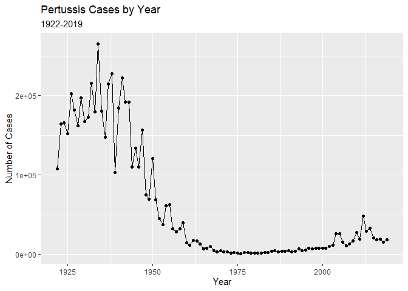
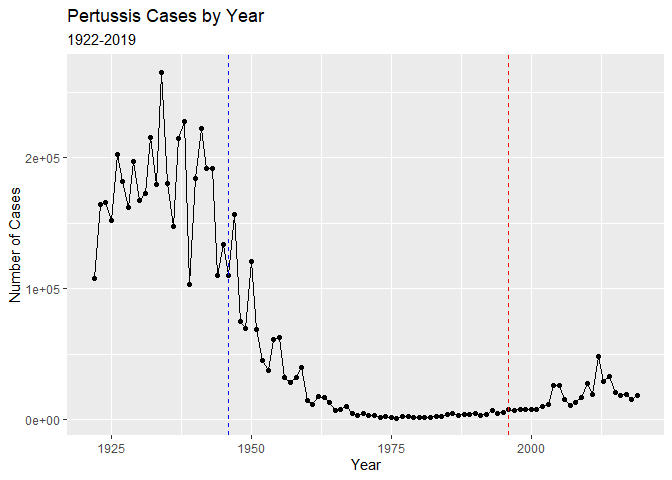
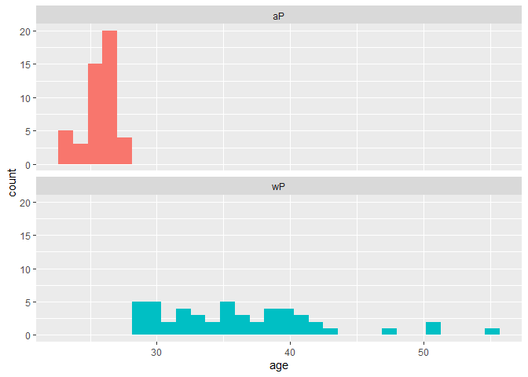
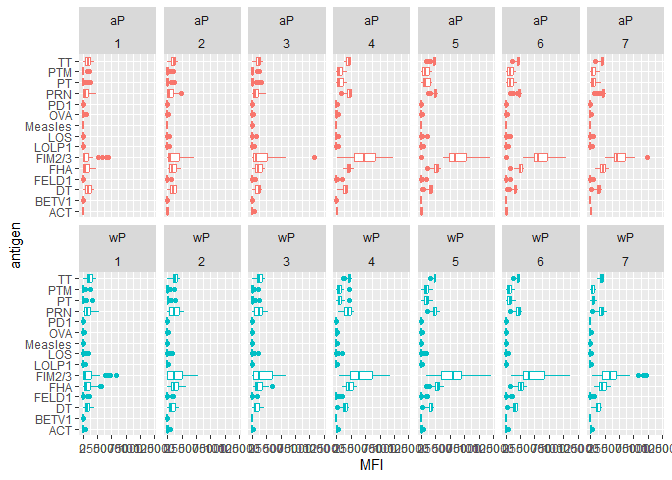
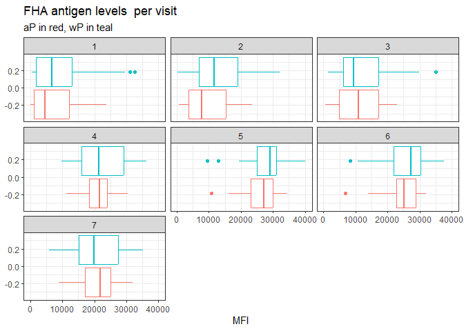
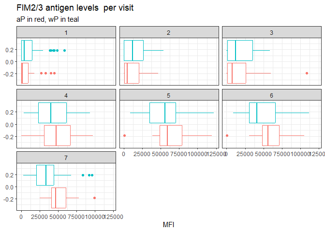

lab19
================
Nate Tran

# Investigating pertussis cases by year

``` r
library(datapasta)
library(ggplot2)
```

## Q1

Plot of pertussis cases by year shown below

Importing CDC pertussis data by year using datapasta

``` r
cdc <- data.frame(
                                 Year = c(1922L,1923L,1924L,1925L,
                                          1926L,1927L,1928L,1929L,1930L,1931L,
                                          1932L,1933L,1934L,1935L,1936L,
                                          1937L,1938L,1939L,1940L,1941L,1942L,
                                          1943L,1944L,1945L,1946L,1947L,
                                          1948L,1949L,1950L,1951L,1952L,
                                          1953L,1954L,1955L,1956L,1957L,1958L,
                                          1959L,1960L,1961L,1962L,1963L,
                                          1964L,1965L,1966L,1967L,1968L,1969L,
                                          1970L,1971L,1972L,1973L,1974L,
                                          1975L,1976L,1977L,1978L,1979L,1980L,
                                          1981L,1982L,1983L,1984L,1985L,
                                          1986L,1987L,1988L,1989L,1990L,
                                          1991L,1992L,1993L,1994L,1995L,1996L,
                                          1997L,1998L,1999L,2000L,2001L,
                                          2002L,2003L,2004L,2005L,2006L,2007L,
                                          2008L,2009L,2010L,2011L,2012L,
                                          2013L,2014L,2015L,2016L,2017L,2018L,
                                          2019L),
         No..Reported.Pertussis.Cases = c(107473,164191,165418,152003,
                                          202210,181411,161799,197371,
                                          166914,172559,215343,179135,265269,
                                          180518,147237,214652,227319,103188,
                                          183866,222202,191383,191890,109873,
                                          133792,109860,156517,74715,69479,
                                          120718,68687,45030,37129,60886,
                                          62786,31732,28295,32148,40005,
                                          14809,11468,17749,17135,13005,6799,
                                          7717,9718,4810,3285,4249,3036,
                                          3287,1759,2402,1738,1010,2177,2063,
                                          1623,1730,1248,1895,2463,2276,
                                          3589,4195,2823,3450,4157,4570,
                                          2719,4083,6586,4617,5137,7796,6564,
                                          7405,7298,7867,7580,9771,11647,
                                          25827,25616,15632,10454,13278,
                                          16858,27550,18719,48277,28639,32971,
                                          20762,17972,18975,15609,18617)
       )
```

Constructing plot using ggplot2

``` r
ggplot(cdc) +
  aes(Year, No..Reported.Pertussis.Cases) +
  geom_point() +
  geom_line() +
  labs(title="Pertussis Cases by Year", subtitle="1922-2019", x="Year", y="Number of Cases")
```



# Comparing Two Types of Pertussis Vaccines

## Q2

plot below

``` r
ggplot(cdc) +
  aes(Year, No..Reported.Pertussis.Cases) +
  geom_point() +
  geom_line() +
  labs(title="Pertussis Cases by Year", subtitle="1922-2019", x="Year", y="Number of Cases") +
  geom_vline(xintercept=c(1946, 1996), linetype="dashed", col=c("blue", "red"))
```



## Q3

After introduction of the aP vaccine, pertussis cases seem to increase
at a steady rate. The observed trend may be due to more sensitive
testing methods compared to before the inception of PCR-based testing.

# Exploring CMI-PB Data

``` r
library(jsonlite)
```

Loading in subject data form CMI-PB.

``` r
subject <- read_json("https://www.cmi-pb.org/api/subject", simplifyVector = TRUE) 
```

## Q4

There are 47 aP and 49 wP infancy vaccinated subjects

``` r
table(subject$infancy_vac)
```


    aP wP 
    47 49 

## Q5

There are 66 female and 30 male subjects

``` r
table(subject$biological_sex)
```


    Female   Male 
        66     30 

## Q6

Race and biological sex breakdown in table below

``` r
table(subject$biological_sex, subject$race)
```

            
             American Indian/Alaska Native Asian Black or African American
      Female                             0    18                         2
      Male                               1     9                         0
            
             More Than One Race Native Hawaiian or Other Pacific Islander
      Female                  8                                         1
      Male                    2                                         1
            
             Unknown or Not Reported White
      Female                      10    27
      Male                         4    13

# Working with Dates

``` r
library(lubridate)
```


    Attaching package: 'lubridate'

    The following objects are masked from 'package:base':

        date, intersect, setdiff, union

``` r
library(dplyr)
```


    Attaching package: 'dplyr'

    The following objects are masked from 'package:stats':

        filter, lag

    The following objects are masked from 'package:base':

        intersect, setdiff, setequal, union

## Q7

The average age of wP individuals is 36 years, and the average age of aP
individuals is 26; these are significantly different

``` r
subject$age <- time_length(today() - ymd(subject$year_of_birth), "years")

ap <- subject %>% filter(infancy_vac=="aP")
wp <- subject %>% filter(infancy_vac=="wP")

round(summary(ap$age))
```

       Min. 1st Qu.  Median    Mean 3rd Qu.    Max. 
         23      25      26      26      26      27 

``` r
round(summary(wp$age))
```

       Min. 1st Qu.  Median    Mean 3rd Qu.    Max. 
         28      32      35      36      40      55 

## Q8

The age of all individuals at time of boost is stored as the last column
of subject object now

``` r
subject$age_at_boost <- time_length(ymd(subject$date_of_boost) - ymd(subject$year_of_birth), "years")
```

## Q9

These two groups are significantly different, as shown by the histogram
below.

``` r
ggplot(subject) +
  aes(x=age, fill=as.factor(infancy_vac)) +
  geom_histogram(show.legend=F) +
  facet_wrap(vars(infancy_vac), nrow=2)
```

    `stat_bin()` using `bins = 30`. Pick better value with `binwidth`.



# Joining Multiple Tables

Reading and storing specimen and ab_titer tables

``` r
specimen <- read_json("https://www.cmi-pb.org/api/specimen", simplifyVector = TRUE) 
titer <- read_json("https://www.cmi-pb.org/api/ab_titer", simplifyVector = TRUE) 
```

## Q10

Code for joining tables below

``` r
meta <- left_join(specimen, subject)
```

    Joining with `by = join_by(subject_id)`

``` r
abdata <- inner_join(titer, meta)
```

    Joining with `by = join_by(specimen_id)`

## Q11

6698 specimens for IgE, 1413 for IgG, 6141 for IgG1, IgG2, IgG3, IgG4

``` r
table(abdata$isotype)
```


     IgE  IgG IgG1 IgG2 IgG3 IgG4 
    6698 1413 6141 6141 6141 6141 

## Q12

There are signficantly fewer specimens collected on visit 8 than
previous visits

``` r
table(abdata$visit)
```


       1    2    3    4    5    6    7    8 
    5795 4640 4640 4640 4640 4320 3920   80 

# Examining IgG1 Ab Titer Levels

Filtering for IgG1 isotype and excluding the small number of visit8
entries

``` r
ig1 <- abdata %>% filter(isotype == "IgG1", visit!=8)
```

## Q13

Boxplots below

``` r
ggplot(ig1) +
  aes(MFI, antigen) +
  geom_boxplot() +
  facet_wrap(vars(visit), nrow=2)
```


## Q14

FIM2 and FIM3 show significant changes over time. FHA and FRN show
modest increases over time.

Faceting boxplot by type of infancy vaccine

``` r
ggplot(ig1) +
  aes(MFI, antigen, col=infancy_vac ) +
  geom_boxplot(show.legend = FALSE) + 
  facet_wrap(vars(infancy_vac, visit), nrow=2)
```



## Q15

Boxplots below

``` r
filter(ig1, antigen=="FHA") %>%
  ggplot() +
  aes(MFI, col=infancy_vac) +
  geom_boxplot(show.legend =F) +
  facet_wrap(vars(visit)) +
  theme_bw() +
  labs(title="FHA antigen levels  per visit", subtitle="aP in red, wP in teal")
```



``` r
filter(ig1, antigen=="FIM2/3") %>%
  ggplot() +
  aes(MFI, col=infancy_vac) +
  geom_boxplot(show.legend =F) +
  facet_wrap(vars(visit)) +
  theme_bw() +
  labs(title="FIM2/3 antigen levels  per visit", subtitle="aP in red, wP in teal")
```



## Q16

FIM2/3 levels clearly rise over time and far exceed those of other
antigens such as FHA. They peak at visit 5 and then decline, a trend
seen in both aP and wP subjects.

## Q17

The FIM2/3 antigen time course shows that those vaccinated with aP
vaccines have lower Ab titer response to FIM2/3 than those vaccinated
with wP.

# Obtaining CMI-PB RNASeq

``` r
url <- "https://www.cmi-pb.org/api/v2/rnaseq?versioned_ensembl_gene_id=eq.ENSG00000211896.7"

rna <- read_json(url, simplifyVector = TRUE)
```

Joining meta and rna data tables

``` r
ssrna <- inner_join(rna,meta)
```

    Joining with `by = join_by(specimen_id)`

## Q18

Plot below

``` r
ggplot(ssrna) +
  aes(visit, tpm, group=subject_id) +
  geom_point() +
  geom_line(alpha=0.2)
```


## Q19

The expression of IGHG1 reaches its maximum level at visit 4

## Q20

No, this pattern does not match the trend of FIM2/3 antibody titer data
exactly, but this makes sense as the cells would be making more antibody
that would facilitate the maximal response (highest Ab titer against
antigens) seen by visit 5.

``` r
ssrna %>%  
  filter(visit==4) %>% 
  ggplot() +
    aes(tpm, col=infancy_vac) + geom_density() + 
    geom_rug()
```


